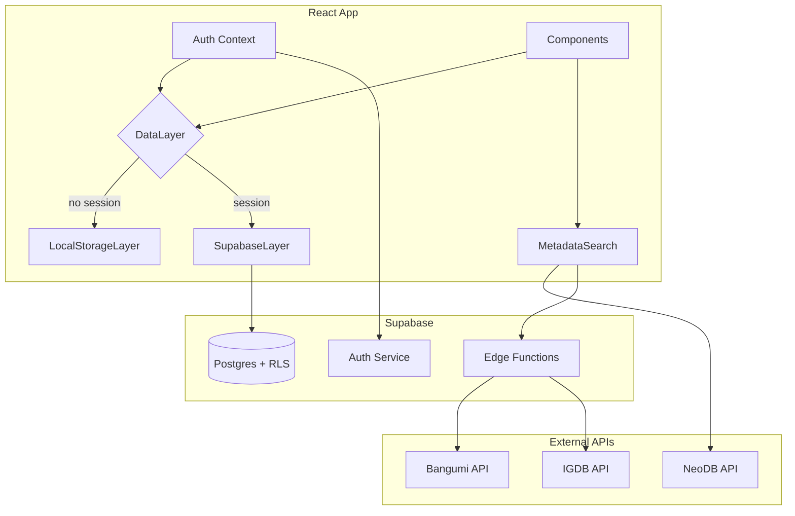
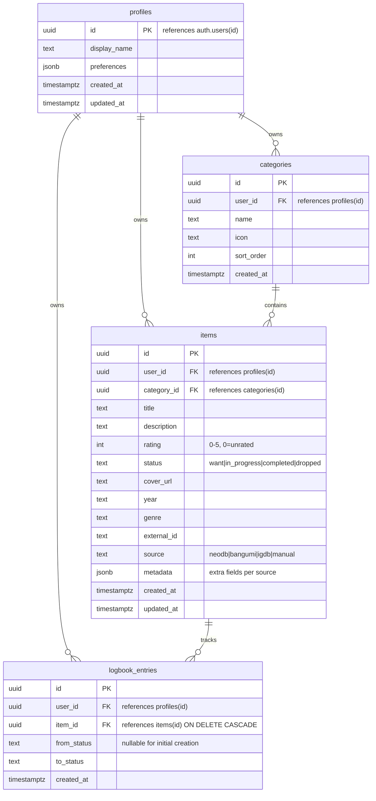

# feat: Liker v1.0 — Supabase Backend, Metadata Enrichment, Logbook

## Overview

Evolve Liker from a localStorage-only prototype into a Supabase-backed personal media tracker with auto-metadata enrichment and logbook/status tracking. The app preserves its zero-friction local mode while adding cloud sync, Chinese-locale metadata search, and consumption timeline features.

## Problem Frame

Liker currently stores all data in localStorage with no sync, no metadata auto-fill, and no activity tracking. Users must manually enter all item details and lose data if they clear their browser. This plan implements the three v1.0 pillars: Supabase backend (R1), auto-metadata from Chinese-friendly sources (R2), and logbook with status tracking (R3). (see origin: docs/brainstorms/2026-03-27-liker-v1-evolution-requirements.md)

## Requirements Trace

- R1.1. Sign up / log in via email + password, optional OAuth (GitHub, Google)
- R1.2. All data syncs to Supabase Postgres
- R1.3. Existing localStorage data migrated on first login
- R1.4. App usable without login (localStorage mode preserved)
- R1.5. Auth state persists across sessions
- R2.1. Search by title when adding items; results show cover, description, year, genre
- R2.2. Data sources: TMDB/OpenLibrary/IGDB (primary) + NeoDB/Bangumi (Chinese fallback)
- R2.3. Select search result to auto-fill item fields
- R2.4. Manual item creation preserved
- R2.5. Cover images as external URLs; Edge Function proxy if needed
- R3.1. Status: want / in-progress / completed / dropped (default: completed)
- R3.2. Status changes logged with timestamps
- R3.3. Logbook view: chronological timeline, filterable
- R3.4. Status displayed as visual badge on items
- R3.5. Category page filterable by status
- R3.6. Rating only shown for completed items

## Scope Boundaries

- No friends/social features (v2.0+)
- No themes/UI customization (v2.0+)
- No Year in Review (v2.0+)
- No smart recommendations beyond current seed-based (v2.0+)
- No PWA/offline-first service worker (v2.0+)
- No Douban import (v2.0+)

## Context & Research

### Relevant Code and Patterns

- `src/types.ts` — Item, Category, AppData types. Item needs expansion: status, coverUrl, year, genre, externalId, source, updatedAt
- `src/store.ts` — `loadData()`/`saveData()` localStorage abstraction. This is the migration seam
- `src/App.tsx` — God component (507 lines). All state, routing, CRUD handlers, recommendation logic. Needs state extraction
- `src/services/recommend.ts` — `ExternalItem` interface already has coverUrl, subtitle, year, source, externalId. Natural extension point for metadata enrichment
- `src/services/steam.ts` + `src/components/SteamSyncModal.tsx` — Three-step modal pattern (config → loading → result), service-layer API abstraction, CORS proxy delegation. Template for new integrations
- `src/components/AddEditModal.tsx` — Current add/edit form. Needs search-to-autofill flow added
- `src/index.css` — CSS variables design system (`:root` block). New components follow `component-element` naming

### Institutional Learnings

No `docs/solutions/` directory exists yet. This is greenfield.

### External References

- **NeoDB API**: Catalog search requires NO auth. `GET /api/catalog/search?query=...&category=...` returns title, cover_image_url, description, rating, tags, genre. Categories: book, movie, tv, music, game. Excellent Chinese content (aggregates Douban + TMDB + Bangumi). Base: `https://neodb.social/api/`
- **Bangumi API**: Chinese-first anime/manga/game database. `POST /v0/search/subjects` with JSON body. Returns name, name_cn, images, summary, rating, tags. Requires User-Agent header. Base: `https://api.bgm.tv`
- **IGDB API**: Twitch OAuth required. 4 req/s limit. `POST /v4/games` with Apicalypse query syntax. Limited Chinese locale. Must proxy via Edge Function
- **Supabase Auth**: `getSession()` + `onAuthStateChange()` pattern. Anon key safe to expose. RLS with `(SELECT auth.uid()) = user_id` is 95% faster
- **Supabase Edge Functions**: Deno runtime. CORS headers required. Secrets via `Deno.env.get()`. Use for IGDB proxy

## Key Technical Decisions

- **NeoDB as primary metadata source for ALL categories**: Research confirmed NeoDB catalog search needs no auth and aggregates Chinese data from Douban, TMDB, IGDB, Bangumi. This simplifies the metadata strategy significantly — NeoDB first, Bangumi fallback for anime/manga, IGDB via Edge Function only for games NeoDB hasn't indexed
- **Simple dual-write data layer over offline-first**: For a personal tracker, a DataLayer abstraction that switches between localStorage and Supabase based on auth state is sufficient. Full offline-first (RxDB/PowerSync) is overkill for v1.0
- **No state management library yet**: Extract state into React Context + custom hooks instead of adding zustand. The app has ~10 state variables — Context is adequate and avoids a new dependency. Revisit if complexity grows
- **Logbook as separate event table**: Status changes stored as timestamped events (event-sourced). This preserves history and enables timeline views without complex item versioning
- **Remove `claude: ^0.1.1` from package.json**: Accidental dependency found during research. Clean up in Unit 1
- **Keep category detection by regex for now**: Both recommend.ts and SteamSyncModal use regex to detect category type. Fragile but works. A proper category `type` field is a v2.0 concern

## Open Questions

### Resolved During Planning

- **OAuth providers**: Start with email + GitHub + Google. WeChat OAuth requires ICP filing and business verification — defer to v2.0 when/if targeting mainland China distribution
- **NeoDB auth for metadata search**: Not needed. Catalog search and item detail endpoints are public
- **Bangumi auth**: Use Personal Access Token (simpler than OAuth). Store server-side in Edge Function secrets
- **Real-time sync strategy**: Optimistic local updates with Supabase as source of truth. No TanStack Query for v1.0 — simple useState + useEffect with Supabase client. The app is single-user; Realtime subscriptions are unnecessary until multi-device sync matters
- **Schema for logbook**: Separate `logbook_entries` table with (id, user_id, item_id, from_status, to_status, timestamp). Event-sourced approach preserves full history

### Deferred to Implementation

- Exact Supabase project region selection (choose closest to target users, likely Singapore or Tokyo)
- NeoDB rate limit behavior under sustained search load — may need client-side debounce tuning
- Bangumi User-Agent string format — needs testing against their validation
- Cover image CORS behavior from NeoDB/Bangumi CDNs — may need proxy, test at implementation time

## High-Level Technical Design

> *This illustrates the intended approach and is directional guidance for review, not implementation specification. The implementing agent should treat it as context, not code to reproduce.*

### Data Flow Architecture

### Database Schema (ERD)

## Implementation Units

### Phase 1: Foundation (R1)

- [ ] **Unit 1: Project setup + Supabase schema**

  **Goal:** Set up Supabase project, define database schema with RLS, configure environment variables, clean up accidental `claude` dependency.

  **Requirements:** R1.1, R1.2

  **Dependencies:** None

  **Files:**
  - Create: `supabase/` directory (Supabase CLI project)
  - Create: `supabase/migrations/001_initial_schema.sql`
  - Create: `.env.local` (gitignored, Supabase credentials)
  - Modify: `package.json` (remove `claude`, add `@supabase/supabase-js`)
  - Modify: `.gitignore` (add `.env.local`, `supabase/.temp/`)

  **Approach:**
  - Initialize Supabase project with `supabase init`
  - Create migration with 4 tables: `profiles`, `categories`, `items`, `logbook_entries` as shown in ERD above
  - Status stored as text with CHECK constraint (`want`, `in_progress`, `completed`, `dropped`)
  - RLS policies: each table has SELECT/INSERT/UPDATE/DELETE restricted to `(SELECT auth.uid()) = user_id`
  - Index on `user_id` for every table (RLS performance)
  - `profiles` table auto-populated via trigger on `auth.users` insert
  - Items cascade-delete logbook entries via FK constraint

  **Patterns to follow:**
  - Supabase RLS: use `(SELECT auth.uid())` wrapped form for performance
  - Environment variables: follow existing `VITE_` prefix pattern from `recommend.ts`

  **Test scenarios:**
  - Migration applies cleanly against fresh Supabase instance
  - RLS blocks cross-user data access (insert as user A, select as user B returns empty)
  - Profile auto-created on new user signup
  - Deleting an item cascades to its logbook entries

  **Verification:**
  - `supabase db push` succeeds
  - Supabase dashboard shows all 4 tables with RLS enabled
  - Manual insert/select test via SQL editor confirms RLS works

---

- [ ] **Unit 2: Type expansion + DataLayer abstraction**

  **Goal:** Expand the Item type with new fields, create a DataLayer interface, and refactor the current `persist()` pattern to use a LocalStorageDataLayer — preserving current behavior while preparing for Supabase.

  **Requirements:** R1.2, R1.4, R3.1

  **Dependencies:** None (can parallel with Unit 1)

  **Files:**
  - Modify: `src/types.ts` (expand Item, add Status type, add DataLayer interface)
  - Create: `src/data/index.ts` (DataLayer interface + factory)
  - Create: `src/data/localStorage.ts` (LocalStorageDataLayer — refactored from store.ts)
  - Modify: `src/store.ts` (thin wrapper or deprecate, re-export from data/)
  - Modify: `src/App.tsx` (use DataLayer instead of direct persist())

  **Approach:**
  - Add to Item: `status`, `coverUrl`, `year`, `genre`, `externalId`, `source`, `metadata`, `updatedAt`
  - New fields are optional for backward compatibility with existing localStorage data
  - `Status` type: `'want' | 'in_progress' | 'completed' | 'dropped'`
  - DataLayer interface: `getItems()`, `getCategories()`, `saveItem()`, `deleteItem()`, `saveCategory()`, `deleteCategory()`, `addLogEntry()`, `getLogEntries()`
  - LocalStorageDataLayer implements DataLayer, wrapping current loadData/saveData logic
  - Existing `store.ts` default data (书籍/电影/音乐 categories) migrates into LocalStorageDataLayer
  - App.tsx `persist()` calls route through DataLayer

  **Patterns to follow:**
  - Current `loadData()`/`saveData()` pattern from `src/store.ts`
  - Keep synchronous localStorage API for LocalStorageDataLayer; async interface for future SupabaseDataLayer compatibility

  **Test scenarios:**
  - App launches and loads existing localStorage data with new optional fields defaulting gracefully
  - CRUD operations work identically to current behavior
  - Existing items without `status` field default to `'completed'`
  - Adding a new item writes all expanded fields to localStorage

  **Verification:**
  - App behavior is identical to current — no visible changes to the user
  - localStorage data structure includes new fields for newly created items
  - Old localStorage data loads without errors (backward compatible)

---

- [ ] **Unit 3: Auth context + Supabase client**

  **Goal:** Create Supabase client singleton, auth context provider, and login/signup modal UI.

  **Requirements:** R1.1, R1.4, R1.5

  **Dependencies:** Unit 1 (Supabase project exists), Unit 2 (DataLayer interface exists)

  **Files:**
  - Create: `src/lib/supabase.ts` (Supabase client singleton)
  - Create: `src/contexts/AuthContext.tsx` (session state, login/logout methods)
  - Create: `src/components/AuthModal.tsx` (email + password, OAuth buttons, signup/login toggle)
  - Modify: `src/App.tsx` (wrap in AuthProvider, show auth prompt, pass session to DataLayer factory)
  - Modify: `src/index.css` (auth modal styles)

  **Approach:**
  - Supabase client created with `VITE_SUPABASE_URL` + `VITE_SUPABASE_ANON_KEY`
  - AuthContext provides: `session`, `user`, `signIn()`, `signUp()`, `signOut()`, `loading`
  - Uses `getSession()` on mount + `onAuthStateChange()` listener with cleanup
  - AuthModal: two-tab design (登录 / 注册), email + password fields, OAuth buttons for GitHub + Google
  - App.tsx shows a non-blocking banner/prompt to sign up (not a gate — R1.4 requires local mode works)
  - DataLayer factory receives session and returns appropriate implementation

  **Patterns to follow:**
  - Modal pattern from `AddEditModal.tsx` (overlay + stopPropagation + btn-primary/secondary)
  - Steam config pattern for remembering auth state

  **Test scenarios:**
  - User can use app without logging in (localStorage mode)
  - Sign up with email creates account + auto-signs in
  - Sign in with existing email works
  - OAuth flow redirects and returns with session
  - Refreshing page preserves session
  - Sign out clears session, app falls back to localStorage mode

  **Verification:**
  - Auth flow completes end-to-end (signup → session → refresh → still signed in)
  - Unauthenticated users see full app functionality with local storage
  - Auth prompt is visible but non-blocking

---

- [ ] **Unit 4: SupabaseDataLayer + data sync**

  **Goal:** Implement the Supabase-backed DataLayer and wire it into the app so authenticated users read/write from Postgres.

  **Requirements:** R1.2

  **Dependencies:** Unit 2 (DataLayer interface), Unit 3 (auth context + Supabase client)

  **Files:**
  - Create: `src/data/supabase.ts` (SupabaseDataLayer implementation)
  - Modify: `src/data/index.ts` (factory returns SupabaseDataLayer when session exists)
  - Modify: `src/App.tsx` (switch DataLayer based on auth state, handle async operations)

  **Approach:**
  - SupabaseDataLayer implements same DataLayer interface using `supabase.from('items').select()` etc.
  - All queries include `.eq('user_id', user.id)` for RLS performance
  - Writes are optimistic: update local state immediately, then sync to Supabase. On error, rollback local state
  - DataLayer factory: `session ? new SupabaseDataLayer(supabase, user) : new LocalStorageDataLayer()`
  - When auth state changes (login/logout), App.tsx re-initializes data from the appropriate layer

  **Patterns to follow:**
  - Current `persist()` pattern (atomic state + storage update) adapted for async
  - Error handling: catch Supabase errors, show toast-style feedback, rollback optimistic update

  **Test scenarios:**
  - Authenticated user's CRUD operations persist to Supabase (verify via dashboard)
  - Logging out switches to localStorage seamlessly
  - Logging back in loads data from Supabase
  - Network error during save shows error feedback and rolls back local state
  - Concurrent operations don't cause race conditions (debounce rapid saves)

  **Verification:**
  - Create item while logged in → visible in Supabase dashboard
  - Log out → localStorage mode works independently
  - Log in on different browser → same data appears

---

- [ ] **Unit 5: localStorage → Supabase migration**

  **Goal:** On first login, migrate existing localStorage data to Supabase so users don't lose their collection.

  **Requirements:** R1.3

  **Dependencies:** Unit 4 (SupabaseDataLayer working)

  **Files:**
  - Create: `src/data/migration.ts` (migration logic)
  - Modify: `src/contexts/AuthContext.tsx` or `src/App.tsx` (trigger migration on first login)
  - Modify: `src/index.css` (migration progress UI styles)

  **Approach:**
  - On first successful login, check if user has any data in Supabase. If empty AND localStorage has data → offer migration
  - Migration UI: modal showing progress ("正在迁移 X 条记录...")
  - Migration steps: read localStorage → bulk insert categories → bulk insert items (with new category IDs mapped) → mark migration complete (store flag in Supabase user preferences)
  - Deduplication: skip items where title + categoryId already exist in Supabase
  - After successful migration, localStorage data is preserved as fallback (not deleted)
  - Migration is idempotent — can be re-triggered safely

  **Patterns to follow:**
  - Steam sync result pattern (progress → result → done)

  **Test scenarios:**
  - User with 50 localStorage items logs in for first time → all items appear in Supabase
  - User with 0 localStorage items logs in → no migration prompt
  - User who already migrated logs in again → no duplicate migration
  - Migration with categories that have hardcoded IDs ('books', 'movies', 'music') maps to new UUIDs correctly
  - Network failure during migration → partial state is recoverable, user can retry

  **Verification:**
  - Full localStorage dataset appears in Supabase after migration
  - Item count matches pre- and post-migration
  - Categories and item-category relationships are preserved

---

### Phase 2: Metadata Enrichment (R2)

- [ ] **Unit 6: Metadata search service**

  **Goal:** Create a unified metadata search service that queries NeoDB (primary) with Bangumi fallback for anime/manga.

  **Requirements:** R2.1, R2.2, R2.3

  **Dependencies:** None (can parallel with Phase 1)

  **Files:**
  - Create: `src/services/metadata.ts` (unified search interface + NeoDB/Bangumi clients)
  - Modify: `src/types.ts` (add MetadataResult type if not already covered by expanded ExternalItem)

  **Approach:**
  - `MetadataResult` interface: title, coverUrl, description, year, genre/tags, externalId, source
  - `searchMetadata(query, category)` dispatches to the right source:
    - All categories → NeoDB first (`GET /api/catalog/search?query=...&category=...`)
    - Anime/manga → Bangumi if NeoDB results are sparse (`POST /v0/search/subjects`)
    - Games → IGDB via Edge Function if NeoDB results are sparse (Unit 7)
  - NeoDB needs no auth — direct fetch from browser (verify CORS at implementation time; proxy via Edge Function if blocked)
  - Bangumi needs User-Agent header — may need Edge Function proxy if browser blocks custom headers
  - Results normalized to common MetadataResult format
  - Debounce search input (300ms)

  **Patterns to follow:**
  - `src/services/recommend.ts` pattern: per-source search functions returning typed arrays, unified dispatcher
  - `ExternalItem` interface structure for result shape

  **Test scenarios:**
  - Search "三体" with category "book" → NeoDB returns Chinese book results with covers
  - Search "进击的巨人" with category auto-detected as anime → Bangumi results appear
  - Search "Zelda" with category "game" → NeoDB results, IGDB fallback if sparse
  - Empty query returns empty results (no API call)
  - API error returns empty results gracefully (no crash)
  - Rapid typing only triggers one API call (debounce)

  **Verification:**
  - Console shows correct API being called for each category
  - Results include Chinese titles, cover URLs, and descriptions
  - No CORS errors in browser console (or fallback to Edge Function works)

---

- [ ] **Unit 7: Edge Functions for API proxying**

  **Goal:** Create Supabase Edge Functions to proxy IGDB (requires secrets) and Bangumi (if CORS-blocked from browser).

  **Requirements:** R2.2, R2.5

  **Dependencies:** Unit 1 (Supabase project exists)

  **Files:**
  - Create: `supabase/functions/_shared/cors.ts` (shared CORS headers)
  - Create: `supabase/functions/search-igdb/index.ts` (IGDB proxy)
  - Create: `supabase/functions/search-bangumi/index.ts` (Bangumi proxy — if needed after CORS testing)

  **Approach:**
  - Each Edge Function: handle OPTIONS preflight, parse request body, call external API with server-side secrets, return normalized results
  - IGDB: Twitch Client Credentials flow for token, cache token until expiry (~58 days). Store IGDB_CLIENT_ID + IGDB_CLIENT_SECRET in Supabase secrets
  - Bangumi: forward search with Personal Access Token + proper User-Agent header. Store BANGUMI_TOKEN in Supabase secrets
  - Response shape matches MetadataResult from Unit 6
  - Add basic caching headers (Cache-Control) for repeated searches

  **Patterns to follow:**
  - Steam CORS proxy pattern from `src/services/steam.ts` (but server-side instead of client-side proxy)

  **Test scenarios:**
  - `POST /functions/v1/search-igdb` with `{ query: "Zelda", limit: 10 }` returns game results with covers
  - `POST /functions/v1/search-bangumi` with `{ query: "进击的巨人", type: 2 }` returns anime results
  - Missing or invalid secrets return 500 with descriptive error
  - CORS preflight (OPTIONS) returns correct headers
  - Rate limiting: IGDB respects 4 req/s limit (server-side throttle if needed)

  **Verification:**
  - `curl` against deployed Edge Functions returns valid JSON responses
  - Browser fetch from app domain succeeds without CORS errors
  - Supabase dashboard shows function invocations

---

- [ ] **Unit 8: Enhanced AddEditModal with metadata search**

  **Goal:** Add a search-to-autofill flow to the AddEditModal so users can find and import metadata when adding items.

  **Requirements:** R2.1, R2.3, R2.4

  **Dependencies:** Unit 6 (metadata search service), Unit 2 (expanded Item type)

  **Files:**
  - Modify: `src/components/AddEditModal.tsx` (add search tab/mode, results list, select-to-fill)
  - Create: `src/components/MetadataSearchResults.tsx` (search results display with covers)
  - Modify: `src/index.css` (search results styles, cover image display)

  **Approach:**
  - AddEditModal gets two modes: "搜索添加" (search) and "手动添加" (manual, current behavior)
  - Search mode: text input + category selector → debounced search → results grid with cover thumbnails
  - Selecting a result auto-fills: title, description, coverUrl, year, genre, externalId, source
  - User can edit any auto-filled field before saving
  - Manual mode is identical to current behavior (R2.4 preserved)
  - Cover image displayed as thumbnail in the form and on item cards
  - If in edit mode (existing item), search is available to "re-link" metadata

  **Patterns to follow:**
  - Current AddEditModal form layout and controlled input pattern
  - Recommendation cards from `recommend.ts` integration (cover image display, "+" to add)

  **Test scenarios:**
  - User types "三体" → search results appear with covers and Chinese descriptions
  - Selecting a result fills all fields → user tweaks description → saves
  - Switching to manual mode clears search results, form is empty
  - Edit mode: existing item opens with current data, search can override fields
  - No search results → helpful empty state ("未找到结果，请尝试其他关键词")
  - Slow network → loading indicator during search

  **Verification:**
  - Full flow: search → select → auto-fill → save → item appears with cover image and metadata
  - Manual mode still works exactly as before
  - Cover images display on item cards in both card and list view

---

### Phase 3: Logbook & Status (R3)

- [ ] **Unit 9: Status field + UI integration**

  **Goal:** Add status tracking to items with visual badges and conditional rating display.

  **Requirements:** R3.1, R3.4, R3.6

  **Dependencies:** Unit 2 (expanded Item type with status field)

  **Files:**
  - Modify: `src/components/ItemCard.tsx` (status badge, conditional rating)
  - Modify: `src/components/AddEditModal.tsx` (status selector)
  - Create: `src/components/StatusBadge.tsx` (reusable status display component)
  - Modify: `src/index.css` (status badge styles, status-specific colors)

  **Approach:**
  - StatusBadge component: small colored pill showing status text
    - want: 🔖 想看/想玩/想读 (blue)
    - in_progress: ▶ 在看/在玩/在读 (yellow)
    - completed: ✓ 看过/玩过/读过 (green)
    - dropped: ✗ 搁置 (gray)
  - Status selector in AddEditModal: segmented control or dropdown
  - Default status for new items: `completed` (most common use case — logging things you've already consumed)
  - Rating (StarRating component) only interactive/visible when status is `completed`
  - For items with status != completed, rating shows as disabled/hidden

  **Patterns to follow:**
  - Existing `.pill` CSS class for badge styling
  - StarRating component's conditional rendering pattern

  **Test scenarios:**
  - New item defaults to "completed" status with rating visible
  - Changing status to "want" hides rating
  - Changing status to "completed" shows rating
  - Status badge renders correctly in both card and list view modes
  - Existing items without status field display as "completed" (backward compatible)

  **Verification:**
  - All four statuses display correctly with distinct visual treatments
  - Rating visibility toggles based on status
  - Status persists through save/reload cycle

---

- [ ] **Unit 10: Logbook data layer + activity logging**

  **Goal:** Log status changes as timestamped events and create the data infrastructure for the logbook timeline.

  **Requirements:** R3.2

  **Dependencies:** Unit 2 (DataLayer with addLogEntry), Unit 9 (status field in use)

  **Files:**
  - Modify: `src/data/localStorage.ts` (implement addLogEntry, getLogEntries for localStorage)
  - Modify: `src/data/supabase.ts` (implement addLogEntry, getLogEntries for Supabase)
  - Modify: `src/App.tsx` or relevant handler (trigger log entry on status change and item creation)

  **Approach:**
  - Every status change creates a logbook entry: `{ itemId, fromStatus, toStatus, createdAt }`
  - Item creation creates an initial entry: `{ itemId, fromStatus: null, toStatus: 'completed', createdAt }`
  - LocalStorageDataLayer stores entries in a separate localStorage key (`liker_logbook`)
  - SupabaseDataLayer writes to `logbook_entries` table
  - `getLogEntries(filters)` supports filtering by category, status, date range
  - Entries are ordered by createdAt descending (most recent first)

  **Patterns to follow:**
  - Current persist() atomic update pattern — log entry written alongside item save

  **Test scenarios:**
  - Creating a new item generates one logbook entry (null → completed)
  - Changing status from "completed" to "dropped" generates entry (completed → dropped)
  - Deleting an item cascades logbook entries (Supabase FK constraint)
  - getLogEntries with category filter returns only matching entries
  - Logbook entries survive page reload (persisted correctly)

  **Verification:**
  - After several CRUD + status change operations, logbook contains accurate history
  - Entry count matches expected number of status transitions

---

- [ ] **Unit 11: Logbook timeline view**

  **Goal:** Build the logbook UI — a chronological timeline of consumption activity, filterable by category and status.

  **Requirements:** R3.3

  **Dependencies:** Unit 10 (logbook data layer)

  **Files:**
  - Create: `src/components/LogbookView.tsx` (timeline component)
  - Modify: `src/App.tsx` (add logbook navigation, possibly as a sidebar item or main view)
  - Modify: `src/index.css` (logbook timeline styles)

  **Approach:**
  - New view accessible from sidebar (📓 icon, "记录" label)
  - Timeline layout: grouped by date (today, yesterday, this week, this month, earlier)
  - Each entry shows: item cover thumbnail (if available), item title, status change description ("标记为想看", "看完了"), timestamp
  - Filter bar: category dropdown + status dropdown
  - Empty state: "还没有记录，开始添加你的收藏吧"
  - Pagination or virtual scroll if entries exceed 50 (deferred implementation detail)

  **Patterns to follow:**
  - Overview page layout pattern (heading + grid/list content area)
  - Sidebar nav item pattern from existing category navigation

  **Test scenarios:**
  - Logbook shows entries in reverse chronological order
  - Filtering by category shows only that category's entries
  - Filtering by status (e.g., "completed") shows only completion events
  - Date grouping is correct (entries from today grouped under "今天")
  - Items with cover images show thumbnails; items without show placeholder
  - Empty logbook shows helpful empty state

  **Verification:**
  - User with 20+ logged activities sees a meaningful, scannable timeline
  - Filters reduce the list as expected
  - Navigation to/from logbook view works seamlessly with sidebar

---

- [ ] **Unit 12: Category page status filter**

  **Goal:** Add status filter tabs to the category detail page so users can view items by status within a category.

  **Requirements:** R3.5

  **Dependencies:** Unit 9 (status field on items)

  **Files:**
  - Modify: `src/components/CategorySection.tsx` (add filter tabs above item grid)
  - Modify: `src/App.tsx` (manage status filter state for category view)
  - Modify: `src/index.css` (filter tab styles)

  **Approach:**
  - Filter tabs below category header: 全部 | 想看 | 在看 | 看过 | 搁置
  - "全部" selected by default
  - Tab labels adapt to category type if possible (想看/想玩/想读) — or use generic labels
  - Filter is local state (not persisted), resets when switching categories
  - Item count per status shown on tabs (e.g., "看过 (12)")

  **Patterns to follow:**
  - Existing viewMode toggle (card/list) UI pattern — similar toggle row
  - `filtered` useMemo pattern from App.tsx search filtering

  **Test scenarios:**
  - All filter tabs show correct counts
  - Selecting "想看" shows only items with status "want"
  - Switching categories resets filter to "全部"
  - Filter works with both card and list view modes
  - Zero items for a status → tab shows (0), empty state in content area

  **Verification:**
  - Each filter tab correctly filters the displayed items
  - Counts update in real-time when items are added/edited/deleted

---

## System-Wide Impact

- **State management:** App.tsx needs auth context wrapping and DataLayer integration. This is the highest-risk refactor area due to the god component pattern. Unit 2 establishes the abstraction; subsequent units build on it
- **Error propagation:** Supabase errors should surface as user-visible toast/banner messages, not swallowed silently (unlike current recommend.ts pattern). Implement a lightweight error notification system
- **Data migration risk:** localStorage → Supabase migration (Unit 5) is a one-way operation for users. Must be robust with clear error handling and retry capability
- **API surface parity:** Cover images added to Item type will need display support in ItemCard (both card and list variants), CategorySection, and overview dashboard cards
- **CSS growth:** index.css is already 1420 lines. Units 8-12 add significant new styles. Consider splitting into per-component CSS files if it becomes unwieldy, but defer this refactor to avoid scope creep

## Risks & Dependencies

- **NeoDB CORS from browser**: Research confirmed search needs no auth, but CORS headers are unconfirmed. If blocked, all NeoDB calls must route through an Edge Function (increases latency, adds Unit 7 scope). Mitigate: test early in Unit 6
- **NeoDB single-maintainer risk**: The service could go down. Mitigate: metadata search should gracefully degrade to manual entry. Consider caching results in Supabase for items already imported
- **App.tsx complexity**: At 507 lines today, adding auth + DataLayer + logbook will push it further. The DataLayer abstraction (Unit 2) and Auth Context (Unit 3) extract significant logic, but the component will still grow. Monitor and consider further extraction if it exceeds ~600 lines
- **Supabase free tier limits**: 500MB database, 1GB file storage, 50k monthly active users, 500k Edge Function invocations. Adequate for initial launch but monitor usage

## Phased Delivery

### Phase 1: Foundation (Units 1-5)
Core backend infrastructure. After this phase, users can sign up, sync data, and migrate from localStorage. App works in both local and cloud modes.

### Phase 2: Metadata (Units 6-8)
Auto-enrichment from external APIs. After this phase, users search and auto-fill item metadata with Chinese covers and descriptions.

### Phase 3: Logbook & Status (Units 9-12)
Status tracking and activity timeline. After this phase, users track consumption status and browse their activity history.

Each phase is independently shippable. Phase 1 is the foundation; Phases 2 and 3 can be reordered based on user feedback.

## Sources & References

- **Origin document:** [docs/brainstorms/2026-03-27-liker-v1-evolution-requirements.md](docs/brainstorms/2026-03-27-liker-v1-evolution-requirements.md)
- **NeoDB API:** `https://neodb.social/api/` — catalog search (no auth), item details, trending
- **Bangumi API:** `https://api.bgm.tv` — `POST /v0/search/subjects`, Personal Access Token auth
- **IGDB API:** `https://api.igdb.com/v4` — Twitch OAuth, Apicalypse query syntax, 4 req/s limit
- **Supabase Docs:** Auth quickstart, RLS patterns, Edge Functions CORS handling
- Related code: `src/services/recommend.ts` (ExternalItem pattern), `src/services/steam.ts` (CORS proxy pattern), `src/store.ts` (persistence seam)
