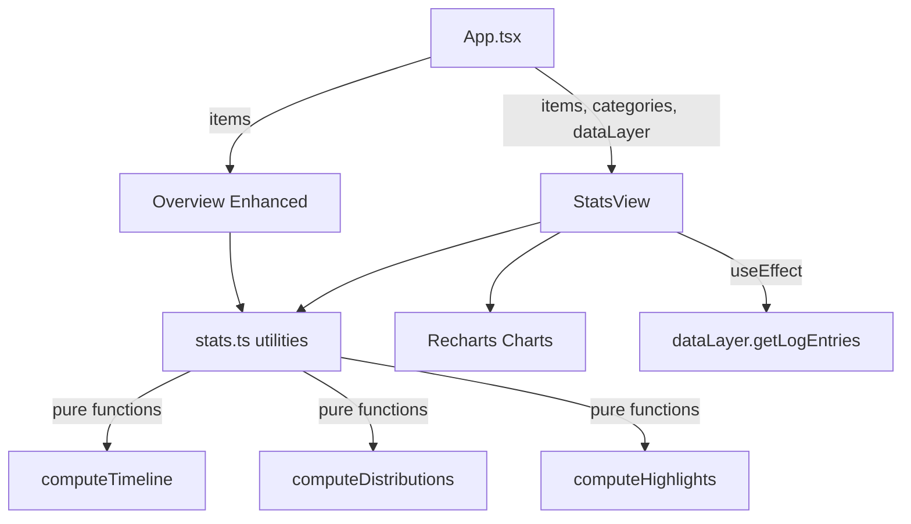

# feat: Stats Dashboard — 数据可视化统计面板

## Overview

为 Liker 添加数据可视化统计面板，包含 Overview 轻量增强和独立统计详情页。使用 Recharts 实现复杂图表（折线图、环形图、柱状图），纯 CSS 实现 stat cards 和简单指标。用户可通过 sidebar 入口进入统计页，并按时间范围筛选数据。

## Problem Frame

v1.0 用户积累了收藏数据，但只能看到最基础的统计（总数、均分）。缺少趋势分析、分布可视化和个性化亮点数据。统计面板让数据本身成为产品吸引力，增强持续记录的动力。(see origin: `docs/brainstorms/2026-03-28-stats-dashboard-requirements.md`)

## Requirements Trace

- R1. Overview 新增近期活动 sparkline
- R2. Overview 各分类卡片增加"本月新增"计数
- R3. Sidebar 新增"统计"入口，进入全屏统计视图
- R4. 统计页顶部 hero 指标卡片
- R5. 时间范围筛选：近 30 天 / 本月 / 本年 / 全部
- R6. 活动时间线面积图/折线图
- R7. 分类分布环形图
- R8. 评分分布柱状图
- R9. 状态分布展示
- R10. 个人记录卡片
- R11. 视觉融合：coral-purple 渐变、Outfit 字体、圆角
- R12. Recharts + 纯 CSS 混合
- R13. 流畅入场动画
- R14. 移动端适配

## Scope Boundaries

- 不包含 Year in Review（独立 feature，但复用本次统计基础设施）
- 不包含数据导出
- 不包含社交/对比统计
- 不新增数据采集 — 仅用现有 Item + LogbookEntry

## Context & Research

### Relevant Code and Patterns

- `src/components/LogbookView.tsx` — 独立视图组件的参考模式：接收 `{ dataLayer, items, categories }` props，内部 `useEffect` 获取 logbook entries，建立 lookup maps
- `src/App.tsx` — 视图切换用 boolean state (`showLogbook`)，sidebar 导航用 `sidebar-nav-item` class
- `src/App.tsx:280-281` — 现有全局统计计算（`totalItems`, `avgRating`）
- `src/index.css:9-38` — CSS 变量系统：`--coral`, `--purple`, `--grad`, `--amber`, `--card-bg`, `--r-xl` 等
- `src/index.css:1451-1466` — 状态颜色：want=蓝, in_progress=琥珀, completed=绿, dropped=灰
- `src/types.ts` — `Item`（含 `createdAt`, `rating`, `status`, `categoryId`, `genre`, `year`）, `LogbookEntry`（含 `createdAt`, `fromStatus`, `toStatus`, `itemId`）
- `src/utils/statusLabels.ts` — 状态配置工具，可复用

### Institutional Learnings

- 无 `docs/solutions/` 目录

## Key Technical Decisions

- **添加 `showStats` boolean state**：与 `showLogbook` 模式一致，避免重构为 union type（保持最小改动）。(see origin: scope boundaries — 不改 types.ts/store.ts)
- **统计计算放在独立 utility 模块**：`src/utils/stats.ts` 导出纯函数，接收 items/entries 数组和时间范围，返回聚合结果。方便复用于 Overview 增强和 Year in Review
- **LogbookEntry 在 StatsView 内部获取**：与 LogbookView 模式一致，不在 App 层加载
- **时间范围筛选为纯前端计算**：不新增后端接口，从内存数据过滤

## Open Questions

### Resolved During Planning

- **聚合粒度策略**："近 30 天"用日聚合，"本月"用日聚合，"本年"用月聚合，"全部"用月聚合。根据时间跨度自动决定
- **Overview sparkline 形式**：使用 Recharts 微型面积图（AreaChart），高度 40px，无轴线，仅展示趋势线形

### Deferred to Implementation

- 个人记录卡片的具体内容项 — 基于实际数据分布决定哪些"亮点"最有意义
- Recharts 主题定制的具体配色映射 — 需实际渲染后微调

## High-Level Technical Design

> *This illustrates the intended approach and is directional guidance for review, not implementation specification. The implementing agent should treat it as context, not code to reproduce.*

数据流：`App` 持有 `items` 和 `categories` 状态 → 传入 `StatsView` → `StatsView` 内部额外获取 `LogbookEntry[]` → 所有数据传给 `stats.ts` 纯函数计算 → 结果驱动 Recharts 图表和 CSS 卡片渲染。

## Implementation Units

- [ ] **Unit 1: 安装 Recharts + 创建统计计算工具模块**

  **Goal:** 安装图表依赖并建立统计数据聚合的纯函数模块

  **Requirements:** R5, R6, R7, R8, R9, R10 的计算基础

  **Dependencies:** None

  **Files:**
  - Modify: `package.json`
  - Create: `src/utils/stats.ts`

  **Approach:**
  - `npm install recharts`
  - `stats.ts` 导出纯函数：接收 `items: Item[]`、`entries: LogbookEntry[]`、`timeRange: '30d' | 'month' | 'year' | 'all'` 和 `categories: Category[]`
  - 函数包括：`filterByTimeRange`（按时间范围过滤 items）、`computeTimeline`（按日/月聚合添加数量）、`computeCategoryDistribution`（各分类占比）、`computeRatingDistribution`（1-5 星分布）、`computeStatusDistribution`（状态分布）、`computeHighlights`（最高评分、最活跃月、最多完成分类等）
  - 聚合粒度：30d/本月 → 日聚合，本年/全部 → 月聚合

  **Patterns to follow:**
  - `src/App.tsx:280-281` 现有的 `totalItems`/`avgRating` 计算风格
  - `src/utils/statusLabels.ts` 作为 utils 模块的组织参考

  **Test scenarios:**
  - 空数据 → 所有聚合返回空数组/零值，不报错
  - 100 条 items 跨 3 个月 → timeline 正确按月聚合
  - 时间范围 "30d" → 只包含最近 30 天的数据

  **Verification:**
  - `stats.ts` 可独立导入使用，不依赖 React 或 DOM

- [ ] **Unit 2: StatsView 组件 + App 集成（sidebar 入口 + 视图路由）**

  **Goal:** 创建统计视图组件骨架，集成到 App 的视图切换系统和 sidebar 导航

  **Requirements:** R3, R4, R5

  **Dependencies:** Unit 1

  **Files:**
  - Create: `src/components/StatsView.tsx`
  - Modify: `src/App.tsx`
  - Modify: `src/index.css`

  **Approach:**
  - `StatsView` 接收 `{ dataLayer, items, categories }` props（同 LogbookView 模式）
  - 内部 `useEffect` 调用 `dataLayer.getLogEntries()` 获取全量 logbook entries
  - 顶部渲染 hero 指标卡片（总条目、本月完成、平均评分、最活跃分类）— 纯 CSS card 组件
  - 包含时间范围选择器（pill 按钮组），选中状态联动所有子图表
  - `App.tsx` 新增 `showStats` state，sidebar 在"活动记录"下方添加"📊 数据统计"导航项
  - Main area 的条件渲染链增加 `showStats` 分支（在 `showLogbook` 之后）

  **Patterns to follow:**
  - `src/components/LogbookView.tsx` — props 接口、useEffect 数据获取、lookup maps
  - Sidebar 导航项：`sidebar-nav-item` class，`nav-icon` + `nav-label` 结构
  - 时间筛选器：复用 `pill` + `active` class 的样式模式（同 `status-filter-bar`）

  **Test scenarios:**
  - 点击 sidebar "数据统计" → 主区域切换到 StatsView
  - 切换到其他视图 → StatsView 隐藏
  - Hero 指标显示正确的总数和均分
  - 时间范围切换 → hero 指标联动更新

  **Verification:**
  - StatsView 在 sidebar 可导航进入，hero cards 显示正确数据，时间筛选器可切换

- [ ] **Unit 3: 活动时间线图表**

  **Goal:** 用 Recharts AreaChart 展示条目添加趋势

  **Requirements:** R6, R11, R13

  **Dependencies:** Unit 2

  **Files:**
  - Modify: `src/components/StatsView.tsx`
  - Modify: `src/index.css`

  **Approach:**
  - 使用 Recharts `AreaChart` + `Area` + `ResponsiveContainer`
  - X 轴为时间（日期），Y 轴为添加数量
  - 面积填充使用 `--grad`（coral→purple 渐变），线条用 `--coral`
  - `ResponsiveContainer` 确保响应式，高度固定 280px
  - 入场动画使用 Recharts 内置的 `animationDuration` 配置
  - 使用 `computeTimeline` 函数生成数据
  - Tooltip 显示日期和数量，使用 Outfit 字体

  **Patterns to follow:**
  - 卡片容器使用 `--card-bg`, `--card-border`, `--card-shadow`, `--r-xl` 变量

  **Test scenarios:**
  - 有数据 → 面积图正确渲染，渐变色显示
  - 切换时间范围 → 图表数据和聚合粒度联动变化（30d 日聚合 → 本年月聚合）
  - 无数据时间段 → 该点显示为 0，不断线
  - 移动端 → 图表宽度自适应

  **Verification:**
  - 面积图可见，配色与主题融合，时间范围切换后图表正确更新

- [ ] **Unit 4: 分布图表（分类环形图 + 评分柱状图 + 状态分布）**

  **Goal:** 展示条目在分类、评分、状态维度的分布

  **Requirements:** R7, R8, R9, R11, R13

  **Dependencies:** Unit 2

  **Files:**
  - Modify: `src/components/StatsView.tsx`
  - Modify: `src/index.css`

  **Approach:**
  - **分类分布**：Recharts `PieChart` + `Pie`（环形），各分类用不同色系（从 coral→purple 渐变中取色），图例显示分类 emoji + 名称 + 百分比
  - **评分分布**：Recharts `BarChart` + `Bar`，X 轴 1-5 星，Y 轴条目数，柱体用 `--amber` 填充（与星级评分色一致）
  - **状态分布**：纯 CSS 水平条形图或 Recharts 横向 BarChart，使用现有状态颜色（蓝/琥珀/绿/灰）
  - 三个图表排列在一行（桌面端），移动端堆叠
  - 每个图表包裹在 card 容器中

  **Patterns to follow:**
  - `src/index.css:1451-1466` 状态颜色变量
  - Card 样式：`--card-bg`, `--r-xl`, padding 24px

  **Test scenarios:**
  - 3 个分类各有 10/20/30 条目 → 环形图显示正确比例
  - 所有条目评分为 5 星 → 柱状图只有第 5 柱有值
  - 状态分布正确区分 want/in_progress/completed/dropped
  - 空分类 → 不显示在环形图中

  **Verification:**
  - 三种分布图表同时可见，配色协调，数据正确

- [ ] **Unit 5: 个人记录卡片**

  **Goal:** 展示个性化亮点数据，如最高评分条目、最活跃月份等

  **Requirements:** R10, R11, R13

  **Dependencies:** Unit 2

  **Files:**
  - Modify: `src/components/StatsView.tsx`
  - Modify: `src/index.css`

  **Approach:**
  - 使用 `computeHighlights` 函数生成亮点数据
  - 渲染为一组 CSS card，每张卡片包含一个 emoji 图标、标题（如"最高评分"）、值（如"百年孤独 ⭐5"）
  - 候选亮点：最高评分条目、本月完成数、最活跃月份（添加最多的月）、完成最多的分类、总观影/阅读时长（如有相关数据）
  - 使用 CSS `@keyframes` 实现卡片交错 fadeUp 入场动画（与 overview category cards 一致）
  - 若某个亮点无数据（如没有评分过的条目），跳过不显示

  **Patterns to follow:**
  - Overview category card 的交错 fadeUp 动画
  - `stat-pill` 的简洁信息展示风格

  **Test scenarios:**
  - 有评分数据 → 显示最高评分条目
  - 全部评分为 0 → "最高评分"卡片不显示
  - 只有 1 个分类 → "完成最多的分类"仍然显示

  **Verification:**
  - 卡片组可见，内容个性化且准确，入场动画流畅

- [ ] **Unit 6: Overview 增强（sparkline + 本月新增）**

  **Goal:** 在 Overview 页增加近期活动可视化和分类月度计数

  **Requirements:** R1, R2

  **Dependencies:** Unit 1, Unit 3（复用 Recharts 和 stats.ts）

  **Files:**
  - Modify: `src/App.tsx`
  - Modify: `src/index.css`

  **Approach:**
  - **Sparkline**：在 stat pills 区域下方或旁边，添加一个微型 Recharts AreaChart（高度 40px，无轴线、无网格），展示最近 30 天的每日添加量。使用 `computeTimeline(items, [], '30d', categories)` 生成数据
  - **本月新增**：各分类 overview card 中，在现有"N 条记录"旁增加"本月 +M"的小标签。计算方式：过滤该分类下 `createdAt` 在本月范围内的 items 数
  - Sparkline 不需要交互（无 tooltip），纯装饰性展示趋势

  **Patterns to follow:**
  - 现有 `stat-pill` 布局
  - Overview category card 的信息密度

  **Test scenarios:**
  - 最近 30 天有数据 → sparkline 显示波动趋势
  - 最近 30 天无数据 → sparkline 显示平线
  - 本月新增 3 条 → 分类卡片显示 "+3"
  - 本月无新增 → 不显示 "+0"（隐藏或不渲染）

  **Verification:**
  - Overview 页可见 sparkline 和月度计数，视觉上不破坏现有布局

## System-Wide Impact

- **Interaction graph:** StatsView 通过 `dataLayer.getLogEntries()` 获取 logbook 数据，与 LogbookView 共享同一 DataLayer 接口，无冲突
- **Error propagation:** `getLogEntries` 失败时 StatsView 应显示空状态而非崩溃，与 LogbookView 的 error handling 模式一致
- **State lifecycle risks:** `showStats`/`showLogbook` 是互斥 boolean — 切换一个时需清除另一个，逻辑已在 sidebar onClick 中覆盖（参考 logbook 的切换模式）
- **API surface parity:** localStorage DataLayer 和 Supabase DataLayer 都实现了 `getLogEntries`，统计功能在登录前后均可用
- **Integration coverage:** 需验证 localStorage 模式下统计功能完整可用（不仅是 Supabase）

## Risks & Dependencies

- **Recharts 包体积**：tree-shaken 后约 45KB。对于 SPA 可接受，但如果用户介意可后续做 lazy import
- **数据量性能**：纯前端聚合，数据量 <10K 时无性能问题。如果未来数据量大增，可考虑 Web Worker 或后端聚合
- **LogbookEntry 数据可能不完整**：v1.0 之前添加的条目没有 logbook 记录，活动时间线可能只反映 v1.0 之后的状态变更。Item 的 `createdAt` 是完整的

## Sources & References

- **Origin document:** [docs/brainstorms/2026-03-28-stats-dashboard-requirements.md](docs/brainstorms/2026-03-28-stats-dashboard-requirements.md)
- Related code: `src/components/LogbookView.tsx`, `src/App.tsx`, `src/utils/statusLabels.ts`
- Related CSS: `src/index.css` (CSS variables L9-38, status colors L1451-1466)
