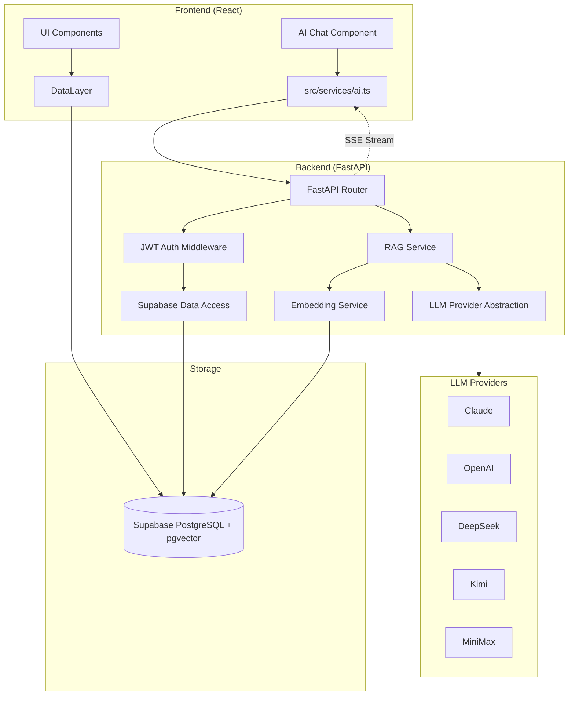

# feat: Add Python AI backend with LLM integration and RAG

## Overview

Add a Python + FastAPI backend to Liker, transforming it from a pure frontend app into a full-stack AI product. The backend provides: multi-provider LLM abstraction (5 providers), RAG-powered taste analysis, natural language search with function calling, and SSE streaming. The frontend gains a `review` text field on items and an AI chat interface.

## Problem Frame

Liker is currently a pure frontend React app with no independent backend and no AI features. The developer (the user) is targeting "AI product company backend engineer" roles and needs a project that demonstrates **backend system engineering + LLM integration + RAG pipeline** capabilities in interviews. (see origin: `docs/brainstorms/2026-03-30-ai-backend-upgrade-requirements.md`)

## Requirements Trace

### Backend Architecture
- R1. Python + FastAPI backend with RESTful API
- R2. Backend reads/writes Supabase via service role key, filtered by user_id
- R3. LLM Provider abstraction: Claude / OpenAI / DeepSeek / Kimi / MiniMax

### Data Model
- R13. Item gains `review` text field for user written reviews
- R14. Frontend AddEditModal adds review textarea
- R15. Review text is high-weight input for embeddings

### AI: Smart Search + Recommendations
- R4. Natural language search via LLM intent parsing + collection query + external API
- R5. Personalized recommendations based on ratings + reviews + history
- R6. LLM function calling to orchestrate search flow

### AI: RAG Taste Analysis
- R7. Embed items (title + description + review + rating + category) into pgvector
- R8. Conversational taste analysis via RAG retrieval + LLM generation
- R9. Auto-update embeddings on item create/update/delete

### Frontend Integration
- R10. AI chat entry point in sidebar
- R11. SSE streaming for AI responses
- R12. One-click add recommendation to collection

### Success Criteria
- SC1. Project clearly reads as "backend + LLM + RAG" to interviewers
- SC2. Can deep-dive on: provider abstraction, RAG pipeline, function calling, SSE
- SC3. Actually works: search and taste analysis return reasonable results
- SC4. README with architecture diagram and technical decisions

## Scope Boundaries

- No auth system rework — keep Supabase Auth, backend validates JWT
- No model fine-tuning or training
- No complex evaluation framework (mention as future direction in README)
- No frontend major refactor — AI features are additive components
- No deployment automation — local dev environment only
- Quality of recommendations is secondary to engineering architecture quality

## Context & Research

### Relevant Code and Patterns

- **DataLayer abstraction** (`src/data/index.ts`): Factory pattern with `createDataLayer(session)` returning localStorage or Supabase implementation. The AI backend is a **separate service layer**, not a DataLayer extension. New frontend AI calls go through a new `src/services/ai.ts`.
- **Supabase data layer** (`src/data/supabase.ts`): Uses `toItem()`/`toRow()` mapping functions between TypeScript camelCase and Postgres snake_case. The backend Python layer needs equivalent mapping.
- **Edge Function pattern** (`supabase/functions/search-igdb/`): JSON request body → normalized `{data: [...]}` response envelope → CORS headers. FastAPI endpoints should follow a similar response envelope.
- **Type definitions** (`src/types.ts`): Item has optional v1.0 fields pattern — `review?: string` follows this convention.
- **AddEditModal** (`src/components/AddEditModal.tsx`): Form fields are local state variables; `doSave()` constructs the save payload. Review textarea goes after star rating section.
- **View state pattern** (`src/App.tsx`): Uses boolean flags (`showStats`, `showLogbook`) for view routing. AI chat uses same pattern (`showAIChat`).
- **Preferences storage**: `profiles.preferences` JSONB column (used by themes) can store AI preferences (selected provider) without schema changes.

### Institutional Learnings

- **Integrate, don't replace**: Backend is an additive AI service layer. DataLayer continues handling CRUD. (from learnings research)
- **Optimistic update pattern**: Frontend updates state immediately, persists to backend async, rolls back on error. AI calls are different — they're request/response, not optimistic.
- **Chinese UI strings**: All user-facing text is in Chinese. AI prompts should instruct the LLM to respond in Chinese.
- **CSS variables design system**: Any new UI follows existing `index.css` variable system.
- **Branch note**: Current branch is `feat/v2-themes`. AI backend work should branch from `main`.

## Key Technical Decisions

### Resolved During Planning

- **Vector DB: pgvector via Supabase** — Supabase has built-in pgvector support. No additional service. Same database as existing data, enabling JOINs between embeddings and items. Sufficient for personal scale (<10K items). Simpler ops story. Alternative considered: ChromaDB (simpler API but separate process) and Qdrant (more powerful but overkill). (origin Q1)

- **Function calling: Single-turn with tool definitions** — LLM receives query + tool definitions → selects and calls tools → returns aggregated result. Sufficient for search/recommendation use case. Multi-turn agent loop adds complexity without proportional value for a 2-week project. Documented as future direction in README. (origin Q2)

- **LLM Provider abstraction: Custom thin abstraction, not litellm** — Define `ChatProvider` and `EmbeddingProvider` protocols. Implement adapters for each provider using their official SDKs. User specifically chose this to demonstrate architecture design skills. litellm would hide the abstraction behind a library, reducing interview talking points. (origin Q3)

- **Embedding update: Real-time on save** — When an item is created/updated/deleted, update the embedding synchronously in the same request. For <10K items, an embedding API call takes ~200-500ms, acceptable latency. Avoids background task infrastructure (Celery/Redis). (origin Q4)

- **Embedding provider: Separate from chat provider** — Not all LLM providers offer embedding APIs (Claude does not). Embedding provider is independently configurable, defaulting to OpenAI `text-embedding-3-small` (best cost/quality ratio). Chat provider is user's choice among 5 options.

- **Backend auth: JWT passthrough** — Frontend sends Supabase JWT in Authorization header. Backend validates it, extracts `user_id`. Backend uses Supabase service role key for DB access but always filters by `user_id`. This is more secure than pure service-role access and demonstrates auth flow understanding in interviews.

- **Backend project structure: `backend/` subdirectory** — New `backend/` directory at project root with its own `pyproject.toml`, `requirements.txt`, virtual environment. Keeps frontend and backend cleanly separated in the same repo.

- **Response envelope: `{data, error, metadata}`** — Consistent with Edge Function pattern (`{data: [...]}`) already used in the project. Add optional `error` and `metadata` fields.

### Deferred to Implementation

- Exact prompt templates for search intent parsing and taste analysis — depends on testing with real data
- pgvector index type (IVFFlat vs HNSW) — depends on data volume at implementation time; start with HNSW for small datasets
- Specific SDK versions for each LLM provider — pin at implementation time based on latest stable
- SSE message format details — implement based on frontend EventSource consumption patterns

## High-Level Technical Design

> *This illustrates the intended approach and is directional guidance for review, not implementation specification. The implementing agent should treat it as context, not code to reproduce.*

### Architecture Overview



### Data Flow: Natural Language Search (R4, R6)

```
User: "帮我找一部像星际穿越的硬科幻电影"
  → POST /api/ai/search {query, stream: true}
  → JWT validation → extract user_id
  → LLM call with function definitions:
      - search_collection(keywords, category, filters)
      - search_external(query, media_type)
      - get_user_preferences(category)
  → LLM selects tools, backend executes them:
      - search_collection → pgvector similarity search on user's items
      - search_external → TMDB/OpenLibrary/iTunes API call
      - get_user_preferences → aggregate user ratings/reviews for category
  → LLM synthesizes results + reasoning
  → SSE stream response to frontend
```

### Data Flow: RAG Taste Analysis (R7, R8)

```
User: "我最喜欢什么类型的电影？"
  → POST /api/ai/chat {message, stream: true}
  → JWT validation → extract user_id
  → Embedding of user query
  → pgvector similarity search: top-K relevant items from user's collection
  → Construct prompt: system context + retrieved items + user query
  → LLM generation with streaming
  → SSE stream response to frontend
```

### Provider Abstraction Shape

```
ChatProvider protocol:
  - chat(messages, tools?, stream?) → response | async generator
  - model_name → str

EmbeddingProvider protocol:
  - embed(texts) → list of vectors
  - dimensions → int

ProviderFactory:
  - create_chat_provider(provider_name, config) → ChatProvider
  - create_embedding_provider(provider_name, config) → EmbeddingProvider
```

## Implementation Units

### Phase 1: Foundation

- [ ] **Unit 1: Backend project scaffolding**

  **Goal:** Create the FastAPI project structure with config, CORS, health check, and dependency management.

  **Requirements:** R1

  **Dependencies:** None

  **Files:**
  - Create: `backend/pyproject.toml`
  - Create: `backend/requirements.txt`
  - Create: `backend/app/__init__.py`
  - Create: `backend/app/main.py`
  - Create: `backend/app/config.py`
  - Create: `backend/app/routers/__init__.py`
  - Create: `backend/.env.example`
  - Test: `backend/tests/test_health.py`

  **Approach:**
  - FastAPI app with CORS middleware allowing frontend origin (configurable, default `http://localhost:5173`)
  - Config via pydantic-settings loading from `.env`: Supabase URL, Supabase service role key, LLM provider name, API keys for each provider, embedding provider name
  - Health check endpoint at `GET /api/health`
  - Project uses `uv` or plain `pip` with `requirements.txt`

  **Patterns to follow:**
  - CORS headers pattern from `supabase/functions/_shared/cors.ts`
  - Env var naming pattern from `.env.example`

  **Test scenarios:**
  - Health check returns 200 with status info
  - CORS preflight returns correct headers
  - Missing required config raises clear error on startup

  **Verification:**
  - `uvicorn backend.app.main:app` starts without error
  - `GET /api/health` returns 200

- [ ] **Unit 2: Database migration — review field + pgvector**

  **Goal:** Add `review` text column to items table and enable pgvector extension for embedding storage.

  **Requirements:** R13, R7

  **Dependencies:** None (can run in parallel with Unit 1)

  **Files:**
  - Create: `supabase/migrations/003_add_review_and_embeddings.sql`
  - Modify: `src/types.ts` (add `review?: string` to Item)
  - Modify: `src/data/supabase.ts` (add review to `toItem()` and `toRow()`)
  - Modify: `src/data/localStorage.ts` (handle review field in normalization)

  **Approach:**
  - SQL migration enables `vector` extension, adds `review TEXT DEFAULT ''` to items, creates `item_embeddings` table with columns: `id`, `item_id` (FK), `user_id`, `embedding vector(1536)`, `content_hash TEXT`, `updated_at`
  - `content_hash` is SHA-256 of the text that was embedded — used to skip re-embedding unchanged items
  - Separate embeddings table (not a column on items) keeps the items table clean and allows re-embedding with different models without altering item data
  - Add HNSW index on the embedding column for similarity search
  - TypeScript `Item` type adds `review?: string` following existing optional field pattern

  **Patterns to follow:**
  - Existing migration style in `001_initial_schema.sql` and `002_categories_unique_name.sql`
  - Optional field pattern in `src/types.ts`
  - `toItem()`/`toRow()` mapping pattern in `src/data/supabase.ts`

  **Test scenarios:**
  - Migration runs without error on existing database
  - Existing items remain intact (review defaults to empty string)
  - New items can be saved with review text
  - Embedding table accepts 1536-dimension vectors
  - HNSW index is created

  **Verification:**
  - `supabase db push` succeeds
  - Items with and without review text round-trip through DataLayer correctly

- [ ] **Unit 3: LLM Provider abstraction layer**

  **Goal:** Implement the multi-provider LLM abstraction with chat and embedding protocols, plus adapters for all 5 chat providers and OpenAI embedding.

  **Requirements:** R3

  **Dependencies:** Unit 1 (project structure)

  **Files:**
  - Create: `backend/app/llm/__init__.py`
  - Create: `backend/app/llm/protocols.py`
  - Create: `backend/app/llm/factory.py`
  - Create: `backend/app/llm/providers/claude.py`
  - Create: `backend/app/llm/providers/openai.py`
  - Create: `backend/app/llm/providers/deepseek.py`
  - Create: `backend/app/llm/providers/kimi.py`
  - Create: `backend/app/llm/providers/minimax.py`
  - Create: `backend/app/llm/providers/__init__.py`
  - Create: `backend/app/llm/embedding.py`
  - Test: `backend/tests/test_llm_providers.py`

  **Approach:**
  - `ChatProvider` protocol: `chat(messages, tools?, stream?)` returning either a response dict or an async generator for streaming
  - `EmbeddingProvider` protocol: `embed(texts)` returning list of float vectors, `dimensions` property
  - Each provider adapter wraps its official SDK: `anthropic` for Claude, `openai` for OpenAI/DeepSeek (compatible API), `openai`-compatible for Kimi (Moonshot uses OpenAI-compatible API), MiniMax SDK
  - DeepSeek and Kimi both use OpenAI-compatible APIs — their adapters can inherit from the OpenAI adapter with different base_url and API key
  - Factory function reads config to instantiate the correct provider
  - Embedding provider defaults to OpenAI `text-embedding-3-small` (1536 dimensions)
  - All providers must normalize tool/function calling to a common format

  **Patterns to follow:**
  - Strategy + Factory pattern
  - DataLayer interface pattern from `src/data/index.ts` (protocol defines contract, factory selects implementation)

  **Test scenarios:**
  - Factory creates correct provider based on config string
  - Each provider adapter can be instantiated with valid config
  - Invalid provider name raises descriptive error
  - Chat method returns expected response structure (mock SDK calls)
  - Streaming chat yields chunks in consistent format
  - Embedding returns vectors of correct dimensionality
  - Tool/function calling works through the abstraction for providers that support it

  **Verification:**
  - All 5 chat providers instantiate without error
  - A simple chat call returns a response through the abstraction
  - Embedding call returns a 1536-dimension vector

- [ ] **Unit 4: Supabase data access + JWT auth middleware**

  **Goal:** Backend can authenticate requests via Supabase JWT and read/write user data from Supabase.

  **Requirements:** R2

  **Dependencies:** Unit 1 (project structure), Unit 2 (schema)

  **Files:**
  - Create: `backend/app/auth.py`
  - Create: `backend/app/db/__init__.py`
  - Create: `backend/app/db/supabase_client.py`
  - Create: `backend/app/db/items.py`
  - Test: `backend/tests/test_auth.py`

  **Approach:**
  - Auth middleware: extract Bearer token from Authorization header → decode Supabase JWT (using the JWT secret from Supabase project settings) → extract `sub` claim as `user_id` → attach to request state
  - Supabase client: initialize with service role key (full access). All queries filter by `user_id` from the authenticated request.
  - Items data access: `get_user_items(user_id)`, `get_user_categories(user_id)`, `get_item_with_category(item_id, user_id)` — returns items with their category info for building embedding text
  - Use `supabase-py` async client for database operations

  **Patterns to follow:**
  - RLS pattern from `001_initial_schema.sql` — even though backend bypasses RLS with service role, always filter by user_id for defense in depth
  - Error handling: Postgres error code `23505` translated to user-facing error (from learnings)

  **Test scenarios:**
  - Valid JWT → request proceeds with user_id in state
  - Missing/invalid/expired JWT → 401 response
  - User can only access their own items (user_id filter works)
  - Non-existent item returns 404

  **Verification:**
  - Authenticated request to a protected endpoint returns user's data
  - Unauthenticated request returns 401

### Phase 2: AI Core

- [ ] **Unit 5: Embedding pipeline**

  **Goal:** Generate, store, and update embeddings for user collection items in pgvector.

  **Requirements:** R7, R9, R15

  **Dependencies:** Unit 2 (pgvector schema), Unit 3 (embedding provider), Unit 4 (data access)

  **Files:**
  - Create: `backend/app/services/embedding.py`
  - Create: `backend/app/db/embeddings.py`
  - Create: `backend/app/routers/embeddings.py`
  - Test: `backend/tests/test_embedding_service.py`

  **Approach:**
  - Text assembly: concatenate `title + category_name + description + review + "评分: {rating}/5"` weighted by importance. Review text gets the most semantic weight naturally since it's the longest free-text field.
  - `content_hash` = SHA-256 of assembled text. On save, compare hash — skip embedding API call if unchanged.
  - Endpoints:
    - `POST /api/embeddings/sync` — bulk sync all items for a user (for initial setup or re-embedding)
    - Embedding update is also triggered by a webhook-style internal call when items change (see Unit 7 for the integration point)
  - Batch embedding: process up to 100 items per API call (OpenAI supports batching)
  - Store in `item_embeddings` table with pgvector

  **Test scenarios:**
  - New item → embedding generated and stored
  - Item updated with different review → new embedding generated (hash changed)
  - Item updated with no content change → embedding skipped (hash matches)
  - Item deleted → embedding row deleted (CASCADE or explicit)
  - Bulk sync correctly embeds all user items
  - Empty review/description items still get embedded (from title + category)

  **Verification:**
  - After syncing, `item_embeddings` table has one row per user item
  - Similarity search returns semantically relevant items

- [ ] **Unit 6: RAG service — taste analysis and conversational chat**

  **Goal:** Implement RAG pipeline: retrieve relevant items via vector similarity, assemble context, generate LLM response with streaming.

  **Requirements:** R8, R11

  **Dependencies:** Unit 3 (LLM provider), Unit 5 (embeddings)

  **Files:**
  - Create: `backend/app/services/rag.py`
  - Create: `backend/app/routers/chat.py`
  - Test: `backend/tests/test_rag_service.py`

  **Approach:**
  - `POST /api/ai/chat` — accepts `{message: string, stream: boolean}`
  - RAG flow:
    1. Embed user's message using embedding provider
    2. pgvector similarity search: `SELECT ... ORDER BY embedding <=> query_embedding LIMIT 10` filtered by user_id
    3. Assemble prompt: system prompt (persona as taste analyst, respond in Chinese) + retrieved items as context (title, category, rating, review) + user message
    4. Call chat provider with assembled messages
  - Streaming: if `stream=true`, return SSE `text/event-stream` response using FastAPI `StreamingResponse` wrapping the provider's async generator
  - SSE format: `data: {"content": "...", "done": false}\n\n` for chunks, `data: {"content": "", "done": true}\n\n` for completion
  - System prompt instructs LLM to: analyze based on user's collection data, cite specific items, respond in Chinese, be conversational

  **Test scenarios:**
  - Chat with items in collection → response references actual items
  - Chat with empty collection → graceful response ("你还没有收藏内容")
  - Stream mode → yields multiple SSE events ending with done=true
  - Non-stream mode → returns complete response in JSON
  - Query about specific category → retrieves items from that category preferentially
  - Very long user message → handled gracefully (truncation or error)

  **Verification:**
  - "我最喜欢什么类型的电影" returns a response citing the user's highest-rated movies
  - SSE stream delivers chunks that concatenate to a complete response

- [ ] **Unit 7: Natural language search with function calling**

  **Goal:** Implement intelligent search: LLM parses intent, calls tools (collection search + external APIs), synthesizes results.

  **Requirements:** R4, R5, R6, R12

  **Dependencies:** Unit 3 (LLM + function calling), Unit 5 (embeddings), Unit 4 (data access)

  **Files:**
  - Create: `backend/app/services/search.py`
  - Create: `backend/app/services/external_apis.py`
  - Create: `backend/app/routers/search.py`
  - Test: `backend/tests/test_search_service.py`

  **Approach:**
  - `POST /api/ai/search` — accepts `{query: string, stream: boolean}`
  - Define tool functions for the LLM:
    - `search_collection(keywords, category?, min_rating?)` → pgvector similarity search + metadata filter on user's items
    - `search_external(query, media_type)` → call TMDB/OpenLibrary/iTunes based on detected media type
    - `get_taste_profile(category?)` → aggregate stats from user's collection (avg rating, top genres, favorite items)
  - Single-turn flow: send query + tool definitions to LLM → LLM returns tool calls → backend executes them → send results back to LLM → LLM generates final response
  - Smart recommendation (R5): when query is recommendation-oriented ("推荐一部电影"), the search service calls `get_taste_profile` to inform the LLM about user preferences before searching externally
  - Response includes structured recommendation items that frontend can render as cards with "一键收藏" button (R12)
  - SSE streaming for the final synthesis step

  **Patterns to follow:**
  - External API call patterns from `src/services/recommend.ts` (searchBooks, searchMovies, searchMusic) — replicate server-side in Python
  - Response envelope `{data, metadata}` from Edge Function pattern

  **Test scenarios:**
  - "帮我找一部像星际穿越的硬科幻电影" → calls search_external with media_type=movie, returns relevant movies
  - "我收藏的书里评分最高的是哪本" → calls search_collection, returns from user's data
  - "推荐一本书" → calls get_taste_profile + search_external, response includes personalized reasoning
  - Query with no clear media type → LLM infers from context or asks for clarification
  - External API failure → graceful degradation (search collection only, mention API issue)
  - Response includes actionable items with enough metadata for one-click add

  **Verification:**
  - Search returns a mix of collection and external results when appropriate
  - Recommendation includes personalized reasoning based on user's taste
  - Function calling executes correctly through the provider abstraction

### Phase 3: Frontend Integration

- [ ] **Unit 8: Frontend — review field in AddEditModal**

  **Goal:** Add review textarea to the item edit form and wire it through the data layer.

  **Requirements:** R13, R14

  **Dependencies:** Unit 2 (types + schema)

  **Files:**
  - Modify: `src/components/AddEditModal.tsx`
  - Modify: `src/index.css` (review textarea styles)

  **Approach:**
  - Add `review` state variable in AddEditModal (same pattern as other form fields)
  - Textarea positioned after star rating, before duplicate warning
  - 4-5 rows, placeholder "写下你的评价..." (Chinese)
  - Visible for all statuses (not just completed) — reviews can be written at any point
  - Include review in `doSave()` payload
  - Pre-populate when editing existing item

  **Patterns to follow:**
  - Existing form field state management pattern in AddEditModal
  - CSS styling consistent with existing textarea (description field)

  **Test scenarios:**
  - New item: can save with review text
  - Edit item: review pre-populated, editable, saved
  - Empty review: saves without issue (optional field)
  - Long review text: textarea scrollable, no layout break

  **Verification:**
  - Items saved with review text → review persists through save/reload cycle
  - Review visible in edit mode for existing items

- [ ] **Unit 9: Frontend — AI chat interface**

  **Goal:** Add AI chat component with SSE streaming consumption, integrated into the sidebar.

  **Requirements:** R10, R11

  **Dependencies:** Unit 6 (chat API), Unit 7 (search API)

  **Files:**
  - Create: `src/components/AIChatPanel.tsx`
  - Create: `src/services/ai.ts`
  - Modify: `src/App.tsx` (add showAIChat state, sidebar button, render panel)
  - Modify: `src/index.css` (chat panel styles)

  **Approach:**
  - `src/services/ai.ts`: API client for backend AI endpoints. Uses `fetch` with `EventSource` or `ReadableStream` for SSE consumption. Sends Supabase JWT in Authorization header.
  - `AIChatPanel.tsx`: Slide-in panel or overlay (not a full page — keeps collection visible). Contains:
    - Message history (user messages + AI responses)
    - Input field with send button
    - Streaming text display (AI response appears character-by-character)
    - Quick action buttons: "分析我的口味", "推荐一部电影", "推荐一本书"
    - Recommendation result cards with "收藏" button
  - Sidebar integration: Add an AI chat button (e.g., "✨ AI 助手") in the sidebar, toggling `showAIChat` boolean state (same pattern as `showStats`, `showLogbook`)
  - Chat state is local (in-memory) — no persistence needed for v1

  **Patterns to follow:**
  - View toggle pattern from App.tsx (`showStats`, `showLogbook`)
  - API call pattern from `src/services/recommend.ts` (fetch + error handling)
  - CSS consistent with existing sidebar and panel styles

  **Test scenarios:**
  - Click AI button → chat panel appears
  - Send message → request sent with JWT → streaming response renders
  - Quick action buttons send predefined queries
  - Backend unreachable → error message displayed (not a crash)
  - Multiple messages → conversation history maintained in-session
  - SSE stream interrupted → partial response displayed with error indicator

  **Verification:**
  - Full round-trip: user types question → backend processes → streaming response appears in chat
  - Quick action buttons work correctly
  - Chat panel doesn't break existing sidebar layout

- [ ] **Unit 10: Frontend — one-click add from AI recommendations**

  **Goal:** AI search/recommendation results include actionable item cards that can be added to the collection with one click.

  **Requirements:** R12

  **Dependencies:** Unit 9 (chat interface), Unit 7 (search API returns structured items)

  **Files:**
  - Modify: `src/components/AIChatPanel.tsx` (render recommendation cards)
  - Modify: `src/services/ai.ts` (parse structured recommendation items from AI response)

  **Approach:**
  - AI search/recommendation responses include a `recommendations` array with structured items: `{title, description, coverUrl, year, genre, source, externalId}`
  - AIChatPanel renders these as mini ItemCards with a "➕ 收藏" button
  - Clicking "收藏" calls the existing `handleSave` flow from App.tsx (passed as prop or via callback)
  - Category auto-selected based on media type detected in search
  - Duplicate detection: if item already in collection, show "已收藏" badge instead

  **Patterns to follow:**
  - ItemCard rendering style from `src/components/ItemCard.tsx`
  - Save flow from AddEditModal's `doSave()` pattern
  - Duplicate detection logic from AddEditModal

  **Test scenarios:**
  - AI recommendation shows cards with title, cover, year
  - Click "收藏" → item added to collection → card shows "已收藏"
  - Item already in collection → "已收藏" shown from the start
  - Missing cover image → fallback display (consistent with existing ItemCard)

  **Verification:**
  - Recommended item can be added to collection in one click
  - Added item appears in the main collection view

### Phase 4: Polish & Documentation

- [ ] **Unit 11: README and architecture documentation**

  **Goal:** Update README with architecture diagram, tech stack, setup instructions, and technical decision rationale.

  **Requirements:** SC4

  **Dependencies:** All previous units

  **Files:**
  - Modify: `README.md`
  - Modify: `CLAUDE.md` (update project description — no longer "pure frontend")
  - Modify: `PLAN.md` (mark AI features as implemented)

  **Approach:**
  - Architecture diagram (Mermaid in README): frontend → FastAPI → LLM providers / pgvector / Supabase
  - Sections: Project Overview, Architecture, Tech Stack, Setup (frontend + backend), AI Features, Technical Decisions, Future Directions
  - Technical decisions section: why pgvector over ChromaDB, why custom abstraction over litellm, why SSE over WebSocket, why single-turn over multi-turn agent
  - Future directions: multi-turn agent, evaluation framework, conversation persistence, multi-modal support
  - Setup instructions: install Python deps, configure `.env`, run migration, start backend + frontend

  **Verification:**
  - README renders correctly on GitHub
  - A new developer can set up the project following README instructions

## System-Wide Impact

- **Interaction graph:** Frontend → (DataLayer for CRUD, ai.ts for AI features) → (Supabase direct for CRUD, FastAPI for AI) → (Supabase for data, LLM providers for AI, pgvector for embeddings). Two parallel data paths that share the same Supabase database.
- **Error propagation:** Backend errors return JSON `{error: {message, code}}`. Frontend ai.ts catches and surfaces as chat error messages. LLM provider failures should not crash the backend — catch and return user-friendly error. SSE stream errors send a final error event before closing.
- **State lifecycle risks:** Embedding can become stale if item is updated via frontend DataLayer without triggering backend embedding update. Mitigation: frontend calls `POST /api/embeddings/item/{id}` after save, or provide a manual "sync embeddings" button. Initial implementation relies on explicit sync; auto-sync is a future enhancement.
- **API surface parity:** The frontend DataLayer (CRUD) and backend data access (read-only for AI) must stay in sync regarding the items schema. The `review` field must be handled in both.
- **Integration coverage:** End-to-end test: save item with review → trigger embedding → ask AI about it → AI references the item. This crosses frontend DataLayer, backend auth, embedding pipeline, RAG service, and LLM provider.

## Risks & Dependencies

| Risk | Impact | Mitigation |
|------|--------|-----------|
| LLM API costs exceed expectations | Budget | Use DeepSeek (cheapest) as default during development; document cost comparison in README |
| Function calling not supported equally across providers | R6 may not work with all providers | Implement function calling for Claude + OpenAI first; other providers fall back to prompt-based tool selection |
| pgvector HNSW index slow on Supabase free tier | Performance | Start with small test data; document scaling notes |
| Supabase JWT validation complexity | Auth | Use `python-jose` or `pyjwt` library; test thoroughly |
| Embedding stale after frontend CRUD | Data consistency | Document as known limitation; provide manual sync endpoint |
| 2-week timeline too tight | Scope | Phase 1+2 are critical (backend + AI core); Phase 3 frontend can be simplified if time-constrained; Phase 4 documentation is non-negotiable for resume value |

## Phased Delivery

### Phase 1: Foundation (Days 1-3)
Units 1-4 in parallel where possible. End state: FastAPI running, DB migrated, LLM abstraction working, auth validated.

### Phase 2: AI Core (Days 4-7)
Units 5-7 sequentially. End state: Embeddings stored, RAG chat working, search with function calling working.

### Phase 3: Frontend Integration (Days 8-11)
Units 8-10. End state: Review field in UI, AI chat panel functional, one-click add works.

### Phase 4: Polish (Days 12-14)
Unit 11. End state: README complete, project ready for resume/GitHub showcase.

**If time is tight:** Phase 3 can be simplified (basic chat input without streaming visualization; skip one-click add). Phase 4 README is non-negotiable — it's the first thing an interviewer sees.

## Documentation Plan

- `README.md`: Full rewrite with architecture, setup, and technical decisions
- `CLAUDE.md`: Update project description to reflect full-stack architecture
- `PLAN.md`: Mark AI backend features as completed
- `backend/.env.example`: Document all required and optional env vars
- `backend/README.md`: Optional — backend-specific setup and API documentation

## Sources & References

- **Origin document:** [docs/brainstorms/2026-03-30-ai-backend-upgrade-requirements.md](docs/brainstorms/2026-03-30-ai-backend-upgrade-requirements.md)
- Related code: `src/data/index.ts` (DataLayer abstraction), `src/services/recommend.ts` (current recommendation), `supabase/functions/search-igdb/index.ts` (Edge Function pattern)
- Related plans: `docs/plans/2026-03-27-001-feat-v1-supabase-metadata-logbook-plan.md` (Supabase integration patterns)
- External docs: Supabase pgvector guide, FastAPI streaming responses, Anthropic tool use docs, OpenAI function calling docs
