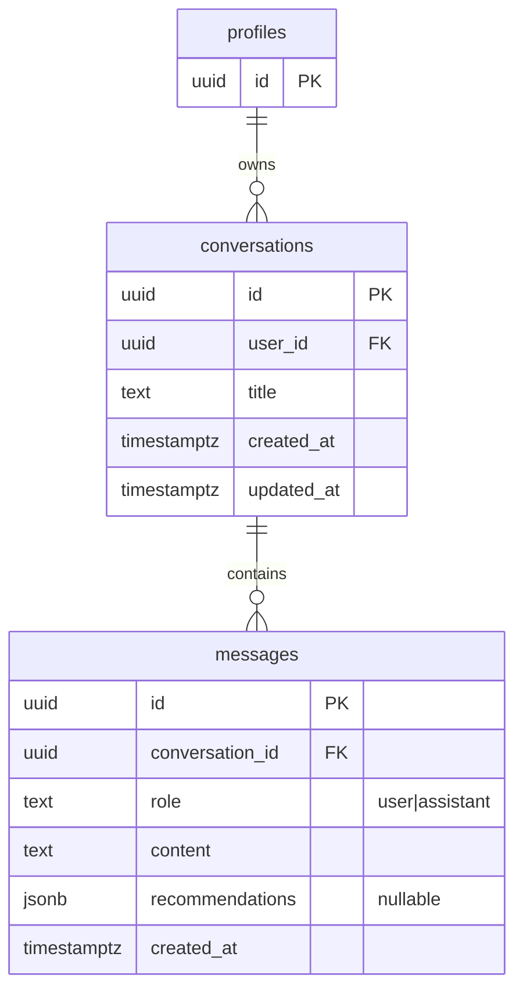
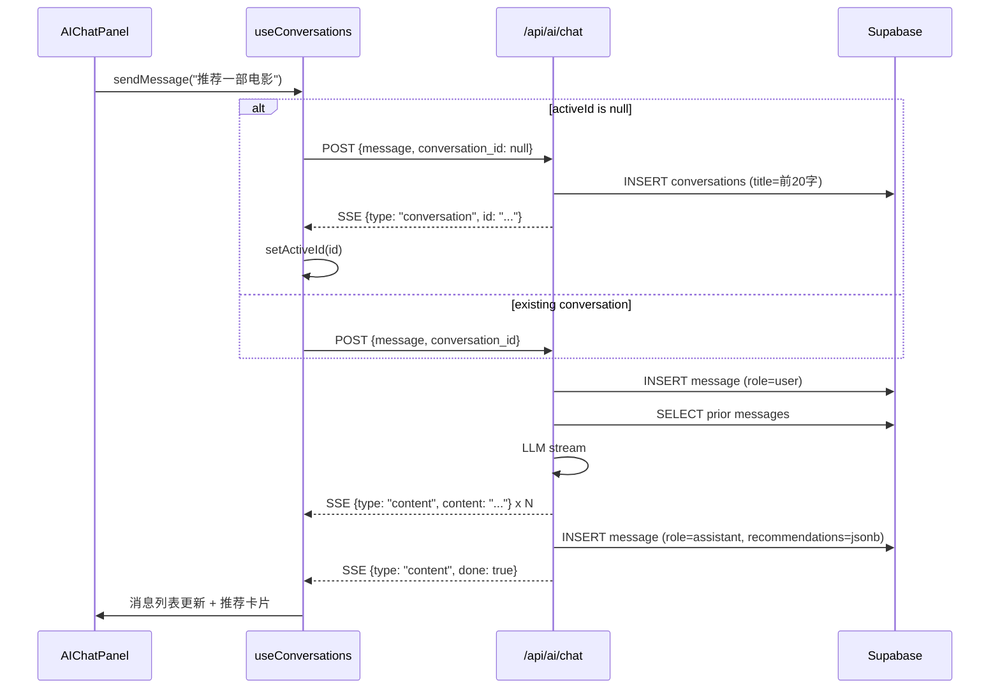

# feat: AI Chat 多会话持久化

## Overview

把 AI 对话从 `AIChatPanel` 的本地 React state 升级为 Supabase 持久化资源。新增 `conversations` + `messages` 两张表；后端 `/api/ai/chat` 和 `/api/ai/search` 接受 `conversation_id` 并负责写库；前端通过新的 `useConversations` hook 聚合状态，`AIChatPanel` 在标题栏下拉切换、行内重命名、二次确认删除。关闭面板 / 刷新页面 / 退出浏览器后，对话完整保留。

## Problem Frame

当前 `AIChatPanel.tsx` 把 `messages` / `recommendations` 都存在组件本地 `useState` 里（lines 12, 16）。关闭面板 → 组件卸载 → state 销毁；硬刷新 → 同样丢失。推荐卡片甚至是「面板级单例」，发送下一条消息会被 `setRecommendations([])` 清空（line 33），无法与对应的助手消息绑定。用户因此无法回看过往分析、不能按话题分组管理、也不能跨设备继续对话。

(see origin: `docs/brainstorms/2026-04-13-ai-chat-multi-conversation-requirements.md`)

## Requirements Trace

- **R1**. 对话持久化，跨关闭/刷新/重启保留
- **R2**. 打开面板默认恢复最近活跃会话，无则欢迎页
- **R3**. 标题栏点击 → 下拉列出全部会话（标题 + 最后更新时间）
- **R4**. 下拉内支持切换 / 行内重命名 / 删除（带二次确认）
- **R5**. 「新建会话」清空面板进入空态，懒创建（首条消息发出时落库）
- **R6**. 标题默认 = 用户首条消息前 20 字，可手动重命名
- **R7**. 推荐卡片与对应助手消息一起持久化，重开对话完整渲染
- **R8**. 打开对话按时间顺序加载全部历史

## Scope Boundaries

- 不做跨设备实时同步（打开时拉一次，无实时订阅）
- 不做对话内搜索、置顶、归档、分组
- 不做消息级编辑 / 重新生成 / 删除单条
- 不做对话分享 / 导出
- 不做软删除 / 回收站
- 不做每对话独立 system prompt
- 不做上下文窗口裁剪（超长对话全量塞 LLM，后续议题）
- 不做 `LocalStorageDataLayer` 的对话持久化实现（AI 功能本就要求登录）

## Context & Research

### Relevant Code and Patterns

**Schema conventions** (参照 `supabase/migrations/001_initial_schema.sql`, `003_add_review_and_embeddings.sql`):
- PK：`uuid PRIMARY KEY DEFAULT gen_random_uuid()`
- FK：`REFERENCES public.profiles(id) ON DELETE CASCADE`
- 时间戳：`timestamptz DEFAULT now()`，`updated_at` 用现有共享触发器 `public.update_updated_at()` bump
- RLS 命名：`users_{action}_own_{resource}`，TO authenticated，`(SELECT auth.uid()) = user_id`
- 索引：每 FK 一个 `idx_{table}_{column}`；时序表（如 `logbook_entries`）额外用 `created_at DESC` —— 是 `conversations(updated_at DESC)` 的模板

**Frontend DataLayer** (`src/data/index.ts`, `src/data/supabase.ts`, `src/data/localStorage.ts`):
- `createDataLayer(session)` 返回 `SupabaseDataLayer`（有登录）或 `LocalStorageDataLayer`（无）
- Supabase 实现每个方法走 `this.supabase.from('<table>').<op>(...).eq('user_id', this.user.id)`
- 行↔域对象手写映射（`toItem` / `toRow`，snake_case ↔ camelCase）

**Backend AI 路由** (`backend/app/routers/chat.py`, `search.py`):
- 统一前缀 `/api/ai`，`Depends(get_current_user_id)` 拿 `user_id`
- SSE 流格式：`data: {json}\n\n`，`chat` 发 `{content, done}`，`search` 多一个 `{type: "recommendations", items}` 起手 + `{type: "content", content, done}` 后续
- `ResponseEnvelope` 只包非流式响应
- `chat_with_rag`（`services/rag.py:74-96`）当前签名不含 `conversation_id` 或 history，`messages` 硬编码 `[system, user]`
- `search_with_tools`（`services/search.py:161-224`）做两次 LLM 调用（tool 选择 + 结果合成），多轮历史必须塞进第一次调用

**Backend DB 客户端** (`backend/app/db/supabase_client.py`):
- 用 **service-role key** → **绕过 RLS**
- 任何新的后端写入必须手动过滤 `user_id`，否则权限漏洞

**前端类型** (`src/services/ai.ts`):
- 已导出 `ChatMessage { role, content }` 和 `RecommendationItem`
- `src/types.ts` 当前没有 chat 相关类型
- 推荐卡片在面板层（`AIChatPanel.tsx:16`），不挂消息

**测试骨架** (`backend/tests/test_rag_service.py`, `test_search_service.py`, `test_auth.py`):
- `pytest` + `pytest-asyncio` + `httpx.AsyncClient(ASGITransport)`
- `_make_token()` HS256 本地签名；`_mock_chat_provider` / `_mock_db_client` 工厂
- 流式 endpoint 测试通过解析 `resp.text` 中 `data: ` 行断言
- 前端无测试基础设施，靠 `docs/acceptance-tests/` 人工验收

### Institutional Learnings

`docs/solutions/` 尚未建立，无历史沉淀可引用。本次实现完成后建议通过 `/ce:compound` 初始化。

需独立规避的典型坑（非 learnings，但研究阶段识别到）：
- **SSE 中断场景**：客户端中途断开 / 面板关闭时，后端正在流的 response 需决定是继续流完写库还是丢弃
- **service-role 越权风险**：后端写新表必须显式 WHERE `user_id = :current_user`
- **types.ts 漂移**：CLAUDE.md 约束「UI 改动不得导致 types.ts 大幅变化」——新类型只加 3 个（Conversation、ChatMessage 规范化、Recommendation），不改已有

### External References

未启动外部调研：技术栈（Supabase + FastAPI + React）在仓库里有密集且一致的本地模式，照抄即可；产品决策已在 brainstorm 收敛。

## Key Technical Decisions

- **后端集中管理持久化 over 前端自写**：`search_with_tools` 的推荐卡片只有后端知道；多轮 history 本来就需要后端加载给 LLM；后端同时写双方消息确保「user + assistant + recommendations」原子一致。前端不直接写 `messages` 表
- **用户消息 eager 写、助手消息 lazy 写**：进入 handler 立刻写 user message，流完再写 assistant message。流失败时用户消息仍在库里，体验上「我的问题没丢」
- **JSONB 列存推荐卡片 over 独立表**：个人工具数据量小，重读整段对话一次 SELECT 解决；推荐卡片结构稳定（`RecommendationItem` 已定义）；没有跨消息查询推荐的需求
- **`conversations.updated_at` 作为「最近活跃」判据**：`messages` INSERT 触发器 bump 上游 `conversations.updated_at`，无需单独 `last_opened_at` 列。切到对话但不发言不会影响排序——这是 MVP 可接受的语义
- **懒创建 conversation**：点「新建会话」只更新前端 `activeId = null`；首条消息 POST 进后端时，若 `conversation_id` 为空则后端创建行并把 id 回传（流前置事件）
- **`useConversations` 自定义 hook over Context/Zustand**：状态边界（会话列表 + 活跃会话 + 消息 + 流）与一个面板强绑定，自定义 hook 粒度最合适；保持 `useAuth` 的风格；Context 仅在跨组件共享时必要
- **标题生成 = 首条 user message 前 20 字**：零成本、避开 MiniMax RPM 限制；Quick action（"分析一下我的品味偏好"）同样作为 user message 参与（无特殊路径）；用户可手动重命名兜底
- **硬删除 + 二次确认**：个人工具不做软删除/回收站。确认对话框用原生 `confirm()` 或轻量自定义 Modal（沿用现有 Modal 模式）
- **DataLayer 只在 Supabase 侧实现 conversations**：`LocalStorageDataLayer` 对应方法抛错 `'AI chat requires sign-in'`；现有 `AIChatPanel.tsx:26-29` 已有未登录提示，行为一致
- **`AIChatPanel` 改造 over 新组件**：保留文件名和大部分布局，refactor 内部；外部调用点（`App.tsx`）接口不变

## Open Questions

### Resolved During Planning

- **持久化节奏（origin R1 deferred）**：用户消息 eager 写、助手消息完成后批写。流中断 → 助手消息不落库；用户消息已在库里可见
- **最近活跃定义（R2 deferred）**：用 `conversations.updated_at`，由 `messages` insert 触发器 bump
- **重命名交互（R4 deferred）**：下拉行内点编辑按钮 → title 变可编辑输入框 → Enter/blur 提交；Esc 取消
- **推荐卡片存储（R7 deferred）**：`messages.recommendations jsonb` 列，随消息一起读写
- **多轮对话连续性（R8 deferred）**：后端接 `conversation_id` → `services/rag.py` / `services/search.py` 查历史 messages → 与新 user message 一起构造 `messages: [system, ...history, user]` 传给 LLM；search 的 tool-selection 调用同样带上历史
- **首条消息是 quick action 的情况（R6 deferred）**：quick action 走 `handleSend(query)`，本质上就是一条 user message；直接取该条前 20 字做标题，无特殊逻辑

### Deferred to Implementation

- **流中途组件卸载的处理**：`AsyncGenerator` 通过 `AbortController` 传递取消信号；后端可通过 `request.is_disconnected()` 检测，决定是否放弃写库。实现时需测试一次看行为
- **`confirm()` vs 自定义 Modal**：先原生 `confirm()`，如风格格格不入再换轻量 Modal（观察现有 Modal 是否可复用）
- **Supabase 前端 SDK 实时订阅**：非目标，但如果后期要加，`conversations` 表 realtime 开关的启用点。此次不开启

## High-Level Technical Design

> *This illustrates the intended approach and is directional guidance for review, not implementation specification. The implementing agent should treat it as context, not code to reproduce.*

### 数据模型（ERD）



### 发一条消息的时序



### 前端状态拓扑

```
AuthProvider
  └─ AIChatPanel (UI only)
       └─ useConversations(session)   ← 拥有所有状态
              ├─ conversations: Conversation[]
              ├─ activeId: string | null
              ├─ messages: ChatMessage[]   (activeId 对应的)
              ├─ loading / error
              └─ 方法: select, create(lazy), send, rename, remove
```

## Implementation Units

- [ ] **Unit 1: DB schema — conversations + messages 表**

**Goal:** 新建两张表 + RLS + 索引 + 触发器，为后续代码提供基础设施

**Requirements:** R1, R2, R7, R8

**Dependencies:** 无（现有 `profiles` 表 + `update_updated_at()` 触发器）

**Files:**
- Create: `supabase/migrations/005_add_ai_conversations.sql`

**Approach:**
- `conversations`：`id`, `user_id` (FK profiles ON DELETE CASCADE), `title` NOT NULL, `created_at`, `updated_at`
- `messages`：`id`, `conversation_id` (FK conversations ON DELETE CASCADE), `role` (CHECK in `'user'`, `'assistant'`), `content` NOT NULL, `recommendations` jsonb nullable, `created_at`
- RLS：两表都 enable，照 `users_{action}_own_{resource}` 四条 policy；messages 的 RLS 通过 JOIN conversations 判断（`EXISTS (SELECT 1 FROM conversations c WHERE c.id = messages.conversation_id AND c.user_id = auth.uid())`）或冗余存 `user_id`
- 索引：`idx_conversations_user_id_updated_at (user_id, updated_at DESC)` 用于下拉列表；`idx_messages_conversation_id_created_at (conversation_id, created_at)` 用于消息按时序加载
- 触发器：`conversations_updated_at` 复用 `public.update_updated_at()`；`messages_bump_conversation` 是新触发器——INSERT ON messages → `UPDATE conversations SET updated_at = now() WHERE id = NEW.conversation_id`

**Patterns to follow:**
- `supabase/migrations/001_initial_schema.sql`（items 表 + items_updated_at 触发器 + RLS 四件套）
- `supabase/migrations/003_add_review_and_embeddings.sql`（另一个 RLS 样板，含 ON DELETE CASCADE 双层）

**Test scenarios:** N/A（纯 schema）。Phase 2 的 DB 层测试间接覆盖。

**Verification:**
- `supabase db push` 或 Dashboard SQL Editor 执行通过
- 新表在 Supabase Dashboard 可见，RLS 开关绿色
- 随便 INSERT 一条 message，对应 conversations 行的 `updated_at` 被触发器 bump

---

- [ ] **Unit 2: Backend — DB 层 + Pydantic schemas**

**Goal:** 封装对 `conversations` / `messages` 的 CRUD 原语，独立可测

**Requirements:** R1, R2, R7, R8

**Dependencies:** Unit 1

**Files:**
- Create: `backend/app/db/conversations.py`
- Modify: `backend/app/schemas.py`
- Create: `backend/tests/test_conversations_db.py`

**Approach:**
- `schemas.py`：新增 `ConversationOut`（id, title, updated_at）和 `MessageOut`（id, role, content, recommendations, created_at）
- `db/conversations.py` 函数（全部接受 `supabase.Client` + `user_id: str`，后端服务端严格过滤 `user_id`）：
  - `list_conversations(client, user_id) -> list[dict]` —— ORDER BY updated_at DESC
  - `get_conversation(client, user_id, conv_id) -> dict | None`
  - `create_conversation(client, user_id, title) -> dict`
  - `update_conversation_title(client, user_id, conv_id, title) -> dict`
  - `delete_conversation(client, user_id, conv_id) -> None`（依赖 ON DELETE CASCADE 删消息）
  - `list_messages(client, conversation_id) -> list[dict]` —— ORDER BY created_at
  - `insert_message(client, conversation_id, role, content, recommendations=None) -> dict`
- 每次写入都手动 `.eq('user_id', user_id)` 二次防护（service-role 绕过 RLS）

**Patterns to follow:**
- `backend/app/db/items.py`（已有的 CRUD 写法）
- `backend/app/db/embeddings.py`（简单 upsert/select）

**Test scenarios:**
- `list_conversations` 过滤 user_id（mock client 返回两行不同 user_id，验证调用链 `.eq('user_id', TEST_USER)`）
- `create_conversation` 返回含 id 的 dict
- `insert_message` 带 recommendations jsonb 能正确序列化
- `delete_conversation` 只调用 delete 一次（CASCADE 由 DB 保证，不做额外 messages 删除）

**Verification:**
- `pytest backend/tests/test_conversations_db.py` 全绿
- mypy / ruff（如仓库里有）通过

---

- [ ] **Unit 3: Backend — conversations CRUD 路由**

**Goal:** 暴露 REST 端点供前端列出/创建（预留）/重命名/删除对话

**Requirements:** R3, R4, R5

**Dependencies:** Unit 2

**Files:**
- Create: `backend/app/routers/conversations.py`
- Modify: `backend/app/main.py`（注册 router）
- Create: `backend/tests/test_conversations_router.py`

**Approach:**
- 前缀 `/api/conversations`，tag `conversations`
- 端点：
  - `GET /` → `ResponseEnvelope(data=list_conversations)`
  - `PATCH /{id}` body `{title: str}` → `ResponseEnvelope(data=updated)`
  - `DELETE /{id}` → `ResponseEnvelope(data={deleted: true})`
- 均用 `Depends(get_current_user_id)`；所有 DB 调用传 `user_id` 做过滤
- **不提供 POST**：创建走 `/api/ai/chat` 懒创建路径（Unit 4）
- 未找到 / 无权限 → 404（不泄露存在性区别）

**Patterns to follow:**
- `backend/app/routers/embeddings.py`（sync + single-item POST 的写法）
- `backend/app/routers/items.py`（如果有，否则看 embeddings）

**Test scenarios:**
- `GET /api/conversations` 未登录 → 401/403
- `GET /api/conversations` 登录 → 返回 list 数据
- `PATCH` 自己的对话 → 200；别人的对话 → 404
- `DELETE` 存在的 → 200；不存在的 → 404
- 所有写操作验证 `user_id` 过滤生效

**Verification:**
- `pytest backend/tests/test_conversations_router.py` 全绿
- 手动 `curl` 带 JWT 调用每个端点通过

---

- [ ] **Unit 4: Backend — RAG/Search 多轮 + 消息持久化**

**Goal:** `/api/ai/chat` 和 `/api/ai/search` 支持 `conversation_id`；服务层自动加载历史、流完写库；推荐卡片与助手消息绑定

**Requirements:** R1, R5, R6, R7, R8

**Dependencies:** Unit 2

**Files:**
- Modify: `backend/app/services/rag.py`
- Modify: `backend/app/services/search.py`
- Modify: `backend/app/routers/chat.py`
- Modify: `backend/app/routers/search.py`
- Modify: `backend/tests/test_rag_service.py`
- Modify: `backend/tests/test_search_service.py`

**Approach:**
- 请求 body 加 `conversation_id: str | None = None`
- 新 helper（可以放在 `backend/app/services/conversation_helpers.py` 或 inline 在 rag/search 里）：
  - `ensure_conversation(client, user_id, conversation_id, first_user_message) -> (conversation_id, is_new)`：若 `None` → 创建新对话（title = first_user_message 前 20 字），否则直接返回
  - `load_history(client, conversation_id) -> list[dict]`：返回 `[{role, content}, ...]`，ORDER BY created_at
- **chat flow**（`chat_with_rag`）：
  1. `ensure_conversation(...)` —— 若新建，流前先发一个 `{"type": "conversation", "id": "..."}` SSE 事件告知前端切 activeId
  2. INSERT user message
  3. `load_history`（含刚插入的 user message）+ retrieve_context(query) → format context → 构造 `messages = [system, *history_without_system_augmentation, user_with_context]`。注意：历史里本来存的 user message 是「原始 message」，而要给 LLM 的最后一条 user 需要带 RAG context，所以 history 回灌取 `[:-1]`，最后一条用 context-augmented 版本
  4. 流 chunks 累积 `assistant_content`
  5. 流结束：INSERT assistant message（content=累积文本，recommendations=None）
- **search flow**（`search_with_tools`）：
  1. `ensure_conversation(...)`，同样发 `{"type": "conversation"}`（在 `{"type": "recommendations"}` 之前）
  2. INSERT user message
  3. `load_history`；tool-selection 调用用 `[system, *history_without_last, user]`
  4. 同样的 tool-results 合成流程
  5. 流结束：INSERT assistant message（content=累积文本，recommendations=本次 `recommendations` 数组或 null）
- **兼容性**：`conversation_id=None` 时不写库、不加载历史，行为等同现状（保留旧路径做 fallback）

**Execution note:** 改造集中、有测试覆盖，适合在已有 test suite 指引下做。先改 `services/rag.py` 跑通单元测试再动 `search.py`。

**Patterns to follow:**
- `backend/app/services/rag.py`（当前单轮实现）
- `backend/app/services/search.py:207-222`（两次 LLM 调用处）
- `backend/app/routers/chat.py`（`StreamingResponse` + `event_generator`）

**Test scenarios:**
- `chat_with_rag` 无 `conversation_id` → 旧路径不变，不查 DB、不写 DB
- `chat_with_rag` 有 `conversation_id` → 创建/写入都走 DB mock，消息 INSERT 两次（user + assistant）
- `chat_with_rag` `conversation_id=None` 且传了 user 消息 → 懒创建新对话，标题取前 20 字
- 超过 20 字的标题被正确截断
- 历史 messages 被正确加载并纳入 LLM 的 `messages`（断言 mock 的 `chat.chat` 收到的 messages 长度 = history + 1）
- `search_with_tools` 流完推荐卡片被写入 `messages.recommendations`
- SSE 事件顺序正确：先 `conversation`（如果新建）→ `recommendations`（search only）→ `content` × N → `done`

**Verification:**
- `pytest backend/tests/test_rag_service.py backend/tests/test_search_service.py` 全绿
- 手动 curl 两个端点分别带和不带 `conversation_id`，行为符合预期

---

- [ ] **Unit 5: Frontend — 类型 + DataLayer 接口扩展**

**Goal:** 建立 Conversation/Message/Recommendation 的前端类型；在 DataLayer 抽象中挂载对话 CRUD（Supabase 实现 + localStorage 抛错桩）

**Requirements:** R1, R3, R4

**Dependencies:** Unit 3（需要端点契约定型）

**Files:**
- Modify: `src/types.ts`（+ Conversation; 引用已有 ChatMessage）
- Modify: `src/data/index.ts`（DataLayer interface 加 5 个方法）
- Modify: `src/data/supabase.ts`（实现）
- Modify: `src/data/localStorage.ts`（每个方法 throw）
- Modify: `src/services/ai.ts`（把 ChatMessage/RecommendationItem 从 inline 提升为 `export type` 的规范形态，顺便加 `id?`, `recommendations?` 字段）

**Approach:**
- `types.ts`：
  - `Conversation { id, title, updatedAt }`
  - 复用 `src/services/ai.ts` 里的 `ChatMessage`（小幅扩展：`id?: string`, `recommendations?: RecommendationItem[]`）
- `data/index.ts` DataLayer 新方法：`listConversations()`, `renameConversation(id, title)`, `deleteConversation(id)`, `listMessages(conversationId)`（注：listMessages 仍走后端 API，不直读 Supabase；但放在 DataLayer 保持一致 —— 或者放在 `services/ai.ts` 新 helper 里更合适）
- **决策点**：为了不污染 DataLayer（它原本管结构化域数据），只把 `listConversations/renameConversation/deleteConversation` 放 DataLayer（Supabase JS SDK 直读直写），`listMessages` 放 `services/ai.ts`（调后端 HTTP，因为后端是唯一写入点，数据权威来源是后端。实际上 listMessages 也可以由 Supabase JS SDK 直读 RLS 过滤后的表，推荐走 Supabase 直读以节省后端）
- **最终决策**：全部 3 个 conversation CRUD + 1 个 listMessages 走 Supabase JS SDK（RLS 保障），都放 DataLayer
- `localStorage.ts`：5 个方法各自 `throw new Error('AI chat 需要登录')`

**Patterns to follow:**
- `src/data/supabase.ts::saveItem/deleteItem`（snake_case ↔ camelCase 映射 + 错误码处理）
- `src/data/index.ts::DataLayer`（interface 声明风格）

**Test scenarios:** N/A（前端无测试）

**Verification:**
- `npx tsc --noEmit` 只剩既有的 `import.meta.env` 预存错误，无新增
- Supabase Dashboard 手动检查 RLS：登录 A，调 `listConversations` 只看到 A 的
- 未登录态下进入 AI panel，相关 action 能被 `throw` 拦住（或被 UI 提示取代）

---

- [ ] **Unit 6: Frontend — `useConversations` hook**

**Goal:** 封装对话列表 + 活跃会话 + 消息 + 流式发送的全部状态和方法，供 `AIChatPanel` 消费

**Requirements:** R1, R2, R5, R6

**Dependencies:** Unit 5

**Files:**
- Create: `src/hooks/useConversations.ts`

**Approach:**
- 签名：`useConversations(dataLayer, accessToken)` —— 返回 `{ conversations, activeId, messages, recommendations, loading, error, selectConversation, newConversation, sendMessage, renameConversation, deleteConversation }`
- 挂载时：
  1. `dataLayer.listConversations()` → setConversations
  2. 若非空 → `selectConversation(conversations[0].id)`（最近活跃 = 首条，因为按 updated_at DESC）
  3. 若空 → `activeId = null`，显示欢迎态
- `selectConversation(id)`：`dataLayer.listMessages(id)` → setMessages（同时把 `messages[].recommendations` 摊到 panel 状态或挂回 message 对象）
- `newConversation()`：`setActiveId(null); setMessages([]); setRecommendations([])` —— 不调后端（懒创建）
- `sendMessage(text)`：
  1. 乐观追加 user message 到 `messages`
  2. POST to `/api/ai/chat` 或 `/api/ai/search`（依 intent routing，逻辑从 AIChatPanel 抽出）with `{message, conversation_id: activeId}`
  3. 消费 SSE 流：
     - 收到 `{type: "conversation", id}` → setActiveId(id)，同时 prepend 到 `conversations`
     - 收到 `{type: "recommendations", items}` → setRecommendations / 挂最新 assistant message
     - 收到 `{type: "content", content, done}` → 累加到正在流的 assistant message
  4. 流完整：更新本地 conversation 的 `updatedAt = now()`，重排到顶
- `renameConversation(id, title)` / `deleteConversation(id)` → 调 DataLayer → 更新本地列表 → 若删的是 active，切到 conversations[0] 或清空

**Patterns to follow:**
- `src/hooks/useAuth.ts`（简洁 hook 样板）
- `src/components/AIChatPanel.tsx:23-74`（现有 sendMessage 逻辑，搬进来优化）

**Test scenarios:** N/A（前端无测试）

**Verification:**
- 在 `AIChatPanel` 使用 hook 后，手动验：登录 → 首次进入显示欢迎态 → 发消息 → 刷新页面 → 仍在该对话且能看到消息
- 开 React DevTools 观察 state 变化节奏合理

---

- [ ] **Unit 7: Frontend — `AIChatPanel` 整合 + 下拉切换 UI**

**Goal:** 把 `AIChatPanel` 改造成纯展示层，标题栏加可点击下拉（列出对话、行内重命名、删除带二次确认、新建会话）

**Requirements:** R3, R4, R5, R6, R7, R8

**Dependencies:** Unit 6

**Files:**
- Modify: `src/components/AIChatPanel.tsx`
- Modify: `src/index.css`（下拉样式）

**Approach:**
- 删除本地 `useState` for messages / recommendations / loading / error，改用 `useConversations` 返回值
- 标题栏：现在是 `<h2>AI 助手</h2>`，改成按钮状元素：
  - 默认显示 `当前对话.title` 或 `AI 助手`（空态）
  - 点击 → 展开下拉面板（绝对定位在标题栏下方）
  - 下拉内容：顶部「+ 新建会话」按钮；下方 conversations 列表，每行 title + 最后更新相对时间 + 右侧 hover 出现的「编辑」「删除」图标
  - 行内编辑：点「编辑」→ title 变 `<input>`，Enter/blur 提交、Esc 取消
  - 删除：点「删除」→ `window.confirm('确认删除对话「${title}」？')` → 是 → 调 hook.deleteConversation
  - 点外部 / 选中一项 → 下拉收起（`useEffect` 监听全局 click / 加 `tabindex + onBlur`）
- 推荐卡片的渲染：不再从面板级 `recommendations` 读，而是从 messages 里带 `recommendations` 字段的那条 assistant 消息渲染（绑定关系反映到 UI）
- `App.tsx` 对 AIChatPanel 的用法不变（只改内部）

**Patterns to follow:**
- 现有 `Menu` / dropdown 组件（若有，未查明；否则按 `AuthModal.tsx` 的定位 + overlay 模式手写）
- CSS 变量系统（`var(--card-bg)`, `var(--card-border)` 等，来自 `src/index.css`）

**Test scenarios:** N/A（前端无测试）

**Verification:**
- 按 Unit 8 的验收清单逐条过
- 视觉一致：下拉样式匹配现有 Modal / Panel 风格
- 键盘：重命名输入框 Enter/Esc 生效，Tab 不跳出

---

- [ ] **Unit 8: 验收清单**

**Goal:** 按 CLAUDE.md 约定产出与本 plan 同名的 acceptance 清单

**Requirements:** 所有

**Dependencies:** Units 1-7 规划完（与实现并行编写）

**Files:**
- Create: `docs/acceptance-tests/2026-04-13-001-feat-ai-chat-multi-conversation-acceptance.md`

**Approach:**
- 按 Phase 组织（Phase 1 = DB + 后端；Phase 2 = 前端；Phase 3 = 端到端）
- 每条用例 checkbox，引用 R 编号
- 含「环境准备步骤」「常见坑」「与 Plan SC 的对应关系」

**Verification:** 清单产出，走查一遍覆盖 R1-R8 全部

---

## System-Wide Impact

- **Interaction graph**：`AIChatPanel` 由 `App.tsx` 单处引用，props 不变。新 hook `useConversations` 内部调 DataLayer 和 `services/ai.ts`；DataLayer 新方法受 `createDataLayer(session)` 分发，登录/未登录分支维持。
- **Error propagation**：后端 DB 写失败 → `RuntimeError` → 由 StreamingResponse 的 generator `except` 捕获 → 发一个 `{type: "error", message}` SSE 事件 → 前端 hook 转成 `error` state → UI 红条展示。用户消息若入库失败，整次请求失败（不展示用户消息）。
- **State lifecycle risks**：
  - 流中途用户切换对话 → 需要 AbortController 取消 fetch；旧流的 chunks 被 stale check 丢弃
  - 流完成后服务端 INSERT 失败 → 助手内容已在前端展示，但刷新后消失。用户会困惑。**缓解**：接收完整助手消息后前端 re-select 当前对话拉一次 messages 验证落库；不一致 → 提示「最后一条消息未保存成功」
  - 删除 active 对话期间另一浏览器 tab 在同一对话里发消息 → 后端 ON DELETE CASCADE 保证不留孤儿；但那个 tab 会在 SSE 过程中报 FK 错误。非 MVP 优化。
- **API surface parity**：新 router `/api/conversations/*`；`/api/ai/chat` 和 `/api/ai/search` 多一个可选 `conversation_id` 字段。前端 AI SDK（`src/services/ai.ts`）的 `streamChat/streamSearch` 签名多一个参数。
- **Integration coverage**：
  - 后端单元测试覆盖 db 层 + router + service 的 mock 路径
  - 跨层行为（SSE 事件顺序、新建对话 id 回传、流完 INSERT 原子性）靠 Unit 8 的手工验收清单

## Risks & Dependencies

- **SSE + DB 写入一致性**（中等）：网络抖动导致客户端断开、服务端已发完 chunks 但 INSERT 前进程死 → 用户看到完整回复但没入库。缓解：写入失败在后端 log；前端载入对话时若缺最后一条 assistant 消息，温和提示（延期到下一个迭代优化）
- **Service-role key 越权**（高）：新 DB 层任何函数忘记 `.eq('user_id', user_id)` 就是安全漏洞。缓解：Unit 2 测试显式覆盖每个函数的 user_id 过滤断言；code review 时重点查
- **Supabase migration 不可回滚**（中等）：003 → 004 的经验是前端期望维度和 DB 列类型必须一致。缓解：005 只加表，不改现有；前端代码的新字段必须对应 DB 实际行为（走 Unit 5 的 TS 类型校验）
- **历史对话变长 → LLM context 爆炸**（非 MVP 风险）：scope 里明确不做裁剪。缓解：监控 `messages` 行数；后续加上下文管理是一个独立 brainstorm
- **依赖顺序**：必须 Unit 1 → Unit 2 → (Unit 3 || Unit 4) → Unit 5 → Unit 6 → Unit 7。Unit 8 与 Unit 7 并行。

## Documentation / Operational Notes

- `PLAN.md`：如其跟踪已完成功能，完成后在「AI 功能」section 标记「多会话持久化 ✓」
- `README.md`：如有功能清单，加一句说明
- `backend/.env.example`：本次无新环境变量
- 前端本地 localStorage 无新增 key（对话数据全部 Supabase）
- 后端监控：可考虑日志记录 `INSERT message` 的耗时，观察 RPM 与 DB 写入瓶颈（后续）

## Sources & References

- **Origin document:** [docs/brainstorms/2026-04-13-ai-chat-multi-conversation-requirements.md](../brainstorms/2026-04-13-ai-chat-multi-conversation-requirements.md)
- Related migrations: `supabase/migrations/001_initial_schema.sql`, `003_add_review_and_embeddings.sql`
- Related frontend: `src/data/supabase.ts`, `src/hooks/useAuth.ts`, `src/components/AIChatPanel.tsx`, `src/services/ai.ts`
- Related backend: `backend/app/services/rag.py`, `backend/app/services/search.py`, `backend/app/routers/chat.py`, `backend/app/routers/search.py`, `backend/app/db/items.py`, `backend/app/db/supabase_client.py`
- Related tests: `backend/tests/test_rag_service.py`, `backend/tests/test_search_service.py`
- Project convention: `CLAUDE.md`（Compound Engineering 工作流 + 验收清单要求）
